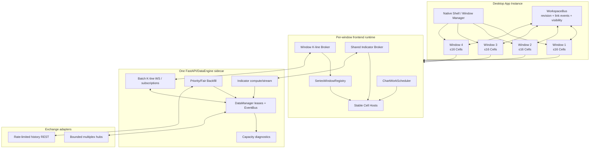

# CandleScope 单窗口 16 图、四窗口 64 图执行文档

> 2026-09-23 默认值更新：窗口内 broker 与批量 K 线传输已独立默认开启，容量开关仍默认关闭。下文各 Phase 的“全部 flags 默认关闭”是当时验收记录；当前默认值和回退方式见 [优化默认启用记录](optimization-defaults-20260923.md)。四物理显示器等容量发布验收状态未改变。

> 状态：`PHASE_8_IMPLEMENTATION_COMPLETE_HARDWARE_AND_REVIEW_PENDING`。Phase 0～8 的实现、自动化门禁、四原生窗口 64 图 W1～W3/F1～F3 实现矩阵、精确 4 小时 soak、64 → 16 → 4 回滚、当前代码 unpacked package 双 fresh-process 和全量基线差分均已完成。当前主机只暴露 1 个逻辑显示器，因此“四个真实显示器拔插及混合 DPI”仍待外部硬件验收；默认 flag 切换仍待独立 release review。所有多图、窗口 broker、批量 K 线和原生多窗口 flags 继续默认关闭；本文只证明“四窗口 64 图实现候选”，不宣称已发布支持四屏 64 图，也不自动授权合并、发布或默认启用。
>
> 起始审查基线：分支 `codex/multi-chart-workspace`，文档起草时 `HEAD=af9233749219f5c0bbc0dd95af2d1f7b3bb9b9f6`（2026-08-06），工作树有 12 个前端布局相关修改。它们已在 Phase 0 前审查、验证并独立冻结为 `035762e8`；Replay 文案基线漂移另行冻结为 `a0129358`。Phase 0 的实际实现基线为 `a012935801c83e583d2e9a53c70ed9112d63582d`。

---

## 1. 执行结论

目标产品合同固定为：

```text
单窗口最多 16 个 Chart Cell
单 Workspace 最多 4 个原生窗口
单应用同时最多 64 个 Chart Cell
```

这个目标可实现，但必须分成两条交付线：

1. **单窗口 16 图**：扩展 Workspace 文档模型、布局编辑、稳定挂载、连接共享、任务调度和单窗口容量门禁。
2. **四窗口 64 图**：新增原生窗口层、跨窗口状态总线、显示器恢复、跨窗口连接/任务治理和最小化降载。

禁止把本项目简化为以下任一种做法：

- 只把 `CHART_CELL_IDS` 从 4 个扩成 16 个；
- 只增加一个 4×4 CSS Grid；
- 用四个互不协调的浏览器窗口冒充正式四屏能力；
- 通过调大线程、缓存或队列上限掩盖重复订阅和冷启动放大；
- 在没有 16/64 图真实浏览器证据前宣称后端“支持 64 图”。

建议工期按一名熟悉仓库的工程师估算：

| 范围 | 预计投入 | 交付含义 |
|---|---:|---|
| Phase 0～5 | 1.5～2.5 周 | 单窗口 16 图达到可发布门槛 |
| Phase 6～8 | 2～4 周 | 原生四窗口、64 图容量与恢复门禁 |
| 合计 | 4～7 周 | 含真实多显示器、冷库、重指标与长稳验证；不含新增交易所协议能力 |

工期是执行量级，不是发布日期承诺。任何上游交易所限制、桌面壳兼容问题或既有基线失败都必须如实进入证据。

---

## 2. 当前真值与已知边界

### 2.1 已具备能力

当前 Workspace 1.0 已具备以下基础：

- 命名 Workspace 的创建、切换、重命名、复制、删除；
- 递归 Split Tree、布局比例、最大化、分割、关闭、拖换；
- Cell 级 session、指标、绘图、价格轴和可见范围隔离；
- Link Group 的市场、周期、十字线、时间锚、日期范围和绘图联动；
- IndexedDB 持久化与 localStorage 降级；
- 同品种 Cell 共享浏览器侧物理 K 线连接；
- 活动 Cell 才开启 Order Book / Trade Flow 重型侧栏能力；
- 活动 Cell 才执行普通后台周期预取。

本文撰写前重新执行以下针对性测试：

```text
WorkspaceLayoutTree
chartWorkspaceEditing
chartWorkspaceLayout
chartWorkspaceStorage
sharedKlineStreamCoordinator
```

结果为 `33/33 passed`。这只证明当前 4 Cell 布局与流共享契约，没有证明 16/64 图容量。

### 2.2 当前硬上限

| 层 | 当前值 | 代码位置 | 影响 |
|---|---:|---|---|
| Workspace Cell | 4 | `frontend/src/features/chart-workspace/chartWorkspaceTypes.ts` | 第五次分割被拒绝 |
| 布局节点 | `2 × cellCount - 1` | `chartWorkspaceLayout.ts` | 当前最多 7 个节点 |
| 布局深度 | 4 | `chartWorkspaceLayout.ts` | 平衡 4×4 可容纳，但任意深链可能被拒绝 |
| 前端单 series bars | 10,000 | `phase1WindowPolicy.ts` | 64 个唯一活动窗口会放大浏览器内存 |
| 后端 K 线缓存 series | 200 | `data_manager/config.py` | 64 图的当前周期和基准周期可能逼近上限 |
| 后端每 series bars | 5,000 | `data_manager/config.py` | 活跃系列内存预算 |
| Backfill 调度并发 | 4 | `backfill_coordinator.py` | 冷启动请求排队 |
| Backfill REST fetch 并发 | 2 | `backfill/config.py` | 空库或缺口场景的上游吞吐边界 |
| 指标线程 | 2 | `backend/app/core/config.py` | 多图重指标冷启动的首要瓶颈候选 |
| 单指标 WS 订阅 | 50 | `backend/app/core/config.py` | 当前前端每 Cell 一条指标 WS，尚未利用单连接多订阅能力 |
| 前端指标缓存 entry | 80 | `indicatorResultCacheStore.ts` | 多图多指标会触发容量压力；活动 lease 可能阻止淘汰 |

### 2.3 “图数”不是后端容量单位

后端管理的是 `SeriesKey`、stream lease、subscriber、backfill 和 indicator job，不存在统一的 `MAX_CHARTS`。

当前每个 Cell 的实时 K 线集合通常为：

```text
trackedIntervals = 当前周期 + 可解析时的 1m 基准周期
```

因此近似容量必须按以下量计算：

```text
logicalCells       = 当前挂载的 Chart Cell 数
uniqueInstruments  = unique(exchange, marketType, symbol)
uniqueSeries       = unique(exchange, marketType, symbol, trackedInterval)
indicatorTargets   = sum(每个 Cell 的可见托管指标数)
physicalUpstreams  = 交易所 adapter 根据 descriptor/multiplex scope 创建的连接数
```

极端情况下，64 个不同品种、当前周期不为 1m，可形成约 128 个实时 series。它低于当前 200 series 静态上限，但没有给 watchlist、预热、自定义周期、其他客户端和恢复任务留下足够余量。

交易所上游还不等价：

- Binance K 线当前为 `path_per_stream`，最坏情况下物理连接接近 native stream descriptor 数；
- OKX 当前按 symbol 建共享 hub，同品种多周期复用，但不同品种仍会扩张连接数；
- 自定义周期可能复用 native base stream，不能用 Cell 数直接推导物理连接数。

所以 Phase 0 必须采集真实 `logical cells → unique series → browser WS → backend lease → upstream WS` 映射，后续所有容量结论都以这条证据链为准。

---

## 3. 产品合同

### 3.1 术语

| 名称 | 含义 |
|---|---|
| Pane | 同一个 Chart Cell 内的主图或指标分窗 |
| Chart Cell | 一个完整、独立的市场/周期/指标/绘图/视口图表 |
| Window | 一个原生桌面窗口，绑定显示器、DPI、bounds 和可见性状态 |
| Workspace | 可保存的窗口集合、Cell、布局树和 Link Group |
| App Instance | 一个桌面应用实例和一套共享后端 sidecar |

### 3.2 数量合同

```text
MAX_CELLS_PER_WINDOW = 16
MAX_WINDOWS_PER_WORKSPACE = 4
MAX_CELLS_PER_APP = 64
```

硬上限只能由代码版本扩大；运行时配置和用户设置只能收紧，不能静默放宽。

超限必须 fail closed：

- 分割到第 17 个 Cell：按钮禁用并显示“当前窗口最多 16 图”；
- 新建第 5 个窗口：拒绝并显示“当前工作区最多 4 个窗口”；
- 恢复损坏或超限文档：保留原始记录，生成诊断，回退到可渲染的安全投影；
- 指标、连接或 backfill 达到预算：明确显示降级/排队状态，不得假装实时。

### 3.3 布局合同

单窗口至少提供以下 preset：

```text
1       单图
2       左右 / 上下
3       主图 + 双确认
4       2×2
6       3×2 / 2×3
8       4×2 / 2×4
9       3×3
12      4×3 / 3×4
16      4×4
custom  任意递归分割，仍受 16 Cell 和深度限制
```

布局编辑、切换 preset、最大化和窗口恢复不能交换 Cell 身份。Cell 的 session、指标、绘图 scope 和视口必须跟随稳定 `cellId`，而不是跟随屏幕位置。

### 3.4 实时语义合同

64 图并不意味着所有任务都以活动图最高频率运行。产品明确使用以下 tier：

| Tier | 对象 | K 线接收 | Canvas 提交 | 指标 preview | 历史/回填优先级 |
|---|---|---|---|---|---|
| `focused` | 当前键盘焦点 Cell | 全量 | rAF 合并，最高优先级 | 开启 | 最高 |
| `visible-primary` | 焦点窗口中其余可见 Cell | 全量 | 合并提交，最多随源频率 | 可配置；默认开启轻量 preview | 高 |
| `visible-secondary` | 其他显示器上可见窗口 | 全量 | 限频合并，不丢 final bar | 默认 closed-bar；允许有限 pinned preview | 中 |
| `hidden` | 被最大化遮挡、切走的 Workspace | 保留共享 store 或按策略释放 | 不渲染 | 停止 | 低 |
| `minimized` | 最小化窗口 | 仅保活必要 stream/store | 不渲染 | 停止 | 暂停 |

任何降频只能合并 forming update，不能丢失 closed/amended bar、回填完成、订阅失败和数据修订。

### 3.5 多窗口合同

正式四屏能力必须满足：

- 一个 Workspace 可以拥有 1～4 个原生窗口；
- 每个窗口有独立 `windowId`、布局树、活动 Cell、bounds、monitor fingerprint、DPI 和最大化状态；
- 一个 App Instance 只启动一个后端 sidecar；
- 同一 Workspace 的窗口通过受控状态总线同步 Link Group 和文档 revision；
- 关闭一个窗口不能停止其他窗口仍持有的 backend stream lease；
- 显示器拔出、顺序改变、DPI 改变后，窗口必须被夹取到仍可见区域；
- 浏览器版可以继续支持单窗口，但不能把 `window.open()` 当成正式桌面恢复方案。

---

## 4. 不可妥协的架构原则

```text
P1 Cell 身份稳定
   布局只引用 cellId；移动、换位、preset 切换不交换 Cell 状态。

P2 单一行情真值
   相同 SeriesKey 使用同一个 SeriesWindowStore；Chart Cell 是消费者，不复制数据所有权。

P3 连接按数据身份复用
   browser/backend/upstream 的连接数由唯一订阅身份决定，不由 React 组件数决定。

P4 前台优先、后台可证明降载
   focused > visible > hidden > minimized；每次降载都必须保留 final/correction 语义。

P5 指标任务有预算
   指标 preview、range compute、线程、WS 订阅和缓存 points 都必须进入诊断与门禁。

P6 持久化可回滚
   schema 升级使用新存储槽；至少两个发布窗口不删除 v5 数据，不让旧 build 覆盖新文档。

P7 多窗口是产品层，不是 CSS 层
   Window 拥有 monitor/bounds/DPI/lifecycle；Workspace 拥有窗口集合；Cell 不感知桌面壳。

P8 所有“支持”都需要容量证据
   单元测试证明契约；真实浏览器/sidecar/upstream 证据证明容量。两者不能互相替代。
```

---

## 5. 目标架构



### 5.1 Workspace schema v6 方向

建议把固定 tuple/Record 模型改为动态 ID，并把 Window 作为一等实体：

```ts
type ChartCellId = string;
type ChartWindowId = string;

interface ChartWindowState {
  id: ChartWindowId;
  layoutTree: ChartWorkspaceLayoutNode;
  activeCellId: ChartCellId;
  maximizedCellId: ChartCellId | null;
  boundsDip: { x: number; y: number; width: number; height: number } | null;
  monitorFingerprint: string | null;
  dpiScale: number | null;
  windowState: "normal" | "maximized" | "minimized";
}

interface ChartWorkspaceDocumentV6 {
  schemaVersion: 6;
  revision: number;
  activeWindowId: ChartWindowId;
  windows: Record<ChartWindowId, ChartWindowState>;
  cells: Record<ChartCellId, ChartCellState>;
  linkGroups: Record<ChartLinkGroupId, ChartLinkGroupSettings>;
}
```

要求：

- 保留现有 `cell-1`～`cell-4` ID，不重写用户已有 scope；
- 新 Cell 使用持久、不可复用的 opaque ID；关闭后 undo 可恢复同一 ID；
- `layoutTree` parser 接受动态 ID，但必须验证 ID 在 `cells` 中、无重复、节点数和深度受限；
- `revision` 用于跨窗口 CAS/冲突检测；
- v5 首次读取复制到独立 v6 store，v5 原始记录保持只读；
- v6 写入失败不能覆盖最近一份可解析 revision。

### 5.2 稳定 Cell Host

当前递归树直接递归渲染 Cell。扩到 16 图后，布局编辑造成的 React reparent/remount 可能重复创建 Lightweight Charts、指标连接和绘图 runtime。

目标结构：

```text
WorkspaceLayoutGeometry
  -> 根据 Split Tree 计算 leaf rect + split handle rect

WorkspaceCellLayer
  -> 所有 LiveChartCell 作为同一稳定父节点的 keyed siblings
  -> 通过 CSS variables/absolute grid area 投影到 leaf rect

WorkspaceSplitHandleLayer
  -> 只负责编辑交互，不拥有 Cell runtime
```

必须用 profiler/counter 证明 preset 切换、换位、调整比例不会无故 remount 未变化 Cell；不能仅凭 React render 次数推断 DOM/Canvas 是否重建。

### 5.3 连接与任务治理

目标连接层分三层：

```text
Cell logical subscription
  -> per-window broker/shard
  -> backend batch subscription + lease/refcount
  -> exchange adapter bounded multiplex
```

建议新增或演进：

```text
frontend/src/features/market-data/feed/windowKlineStreamCoordinator.ts
frontend/src/features/indicators/sharedIndicatorStreamCoordinator.ts
frontend/src/features/chart-workspace/chartWorkScheduler.ts
backend/app/api/v1/stream_klines_batch.py
backend/app/data_engine/data_manager/capacity.py
```

`/stream/klines_batch` 必须是 additive v2 endpoint，旧 `/stream/klines_multi` 在两个发布窗口内保留。建议控制消息：

```json
{
  "action": "subscribe",
  "request_id": "req-1",
  "subscriptions": [
    {
      "client_id": "cell-id",
      "exchange": "binance",
      "market_type": "futures",
      "symbol": "BTCUSDT",
      "intervals": ["1m", "15m"]
    }
  ]
}
```

ACK 必须逐订阅返回 accepted/failed/active，不允许一个失败项让整批订阅状态模糊。

指标连接按 window 池化，并按后端 `maxSubscriptions` 分片；每片预留安全余量，不能正好塞满 50。Cell 销毁只取消自己的 `clientId`，不能关闭其他 Cell 共用的 socket。

---

## 6. 容量预算与发布门槛

### 6.1 固定测试环境

Phase 0 必须记录一台固定基准机：

- CPU 型号、核心数；
- RAM；
- GPU 与驱动；
- Windows 版本；
- Chrome for Testing/WebView2/桌面壳版本；
- 屏幕分辨率、DPI、刷新率和显示器数量；
- Node/Python 版本；
- 后端 DB 路径、是否空库、数据范围和 SHA-256；
- 交易所、market type、symbols、intervals；
- 指标集合和参数。

基准机变化后不能直接把新旧数字做严格回归比较。

### 6.2 场景矩阵

| ID | 窗口/Cell | 市场组合 | 指标 | 数据状态 | 目的 |
|---|---|---|---|---|---|
| S1 | 1×16 | 同品种同周期 | 无 | 热库 | 验证共享 store/连接和纯渲染 |
| S2 | 1×16 | 同品种 8～16 周期 | 无 | 热库 | 验证 interval union 与 adapter multiplex |
| S3 | 1×16 | 16 个不同品种 | 无 | 热库 | 单窗口最坏 K 线 fan-out |
| S4 | 1×16 | 16 个不同品种 | 每图 2 个 builtin | 热库 | 常规指标容量 |
| S5 | 1×16 | 16 个不同品种 | 每图 1 个重 hosted/Pyne | 热库/冷库 | 指标线程和 range compute |
| C1 | 1×16 | 16 个不同品种 | 每图 2 个 | 空库 | backfill、公平性、上游限流 |
| W1 | 4×16 | 64 图、重复品种为主 | 无 | 热库 | 跨窗口共享与渲染 |
| W2 | 4×16 | 64 个不同品种 | 无 | 热库 | K 线最坏容量 |
| W3 | 4×16 | 64 个不同品种 | 每图 2 个 builtin | 热库 | 正式 64 图门禁 |
| F1 | 4×16 | W3 | 同 W3 | 运行中断网/恢复 | 重连风暴与状态一致性 |
| F2 | 4×16 | W3 | 同 W3 | sidecar 重启 | lease/ACK/窗口恢复 |
| F3 | 4×16 | W3 | 同 W3 | 拔出显示器 | bounds/DPI/窗口回收 |

### 6.3 初始门槛

Phase 0 先采基线；若真实基线证明以下阈值不合理，只能在 Phase 0 文档评审中修改，后续 Phase 不得为通过测试临时放宽。

| 指标 | 单窗口 16 图门槛 | 四窗口 64 图门槛 |
|---|---:|---:|
| React/runtime error | 0 | 0 |
| 订阅静默失败 | 0 | 0 |
| closed/amended bar 丢失 | 0 | 0 |
| 同一订阅身份重复 backend lease | 0 | 0 |
| 同一 adapter scope 重复 upstream descriptor | 0 | 0 |
| 热库全部 Cell 可用 p95 | ≤ 3 s | ≤ 8 s |
| 前台输入响应 p95 | ≤ 100 ms | ≤ 150 ms |
| >50 ms 浏览器 long task | ≤ 5/min | ≤ 15/min，全局；焦点窗口 ≤ 5/min |
| 后端 event-loop lag p99 | ≤ 50 ms | ≤ 100 ms |
| 30 分钟 JS heap 增长 | ≤ 15%，且无单调增长 | ≤ 20%，且无单调增长 |
| 1 小时后端 private bytes 增长 | ≤ 15%，且到达平台期 | ≤ 20%，且到达平台期 |
| 单 series bars | ≤ `MAX_SERIES_BARS` | ≤ `MAX_SERIES_BARS` |
| forming update outbox overflow | 0；允许同 key replace | 0；允许同 key replace |
| 最小化窗口 Canvas/indicator preview | 0 | 0 |

空库场景必须分别报告：

```text
browser first usable
HTTP 请求排队
SQLite query/write
backfill coordinator wait
exchange REST admission/wait
真实 upstream download
indicator range compute
```

不能把外网下载时间混成一个“页面加载总耗时”后归咎于浏览器。

### 6.4 连接门槛

最终证据必须同时记录：

```text
logical chart subscriptions
frontend logical K-line subscriptions
browser physical K-line WebSockets
browser indicator WebSockets
backend DataManager leases
backend active SeriesKey
exchange physical WebSockets
exchange REST in-flight / waiting
```

目标不是盲目追求一条连接，而是：

- 同一身份绝不重复；
- 连接数与 unique descriptor/multiplex shard 成正比，不与 Cell 数直接成正比；
- 每个 shard 有显式上限、重连退避和逐项 ACK；
- 达到上限时拒绝新增项并保留已运行项。

---

## 7. 分阶段执行

```text
Phase 0  冻结合同、当前基线和容量证据工具
Phase 1  Workspace schema v6、动态 Cell/Window ID、双槽迁移
Phase 2  单窗口 16 Cell 布局、稳定挂载和密度适配
Phase 3  每窗口 K 线/指标 broker 与 ChartWorkScheduler
Phase 4  后端批量订阅、容量诊断、backfill 公平性与上游去重
Phase 5  单窗口 16 图真实验收与默认关闭发布候选
Phase 6  原生多窗口壳、单 sidecar、显示器/DPI 恢复
Phase 7  跨窗口 WorkspaceBus、64 Cell 调度与故障恢复
Phase 8  64 图终验、长稳、回滚演练和发布切换

严格依赖：0 → 1 → 2 → 3 → 4 → 5 → 6 → 7 → 8
```

每个 Phase 必须独立提交，包含：代码、测试、machine-readable evidence、本文勾选状态和回滚说明。禁止把 Phase 1～8 压成一个不可审查的大提交。

---

## Phase 0：合同、基线与证据工具

### 目标

不改变运行行为，冻结当前 1/2/4 Cell 真值，建立之后判断 16/64 图是否真的可用的同一把尺子。

### 任务

- [x] 0.1 分类当前工作树 12 个布局修改，明确哪些属于 Workspace 编辑能力，哪些尚未验证。
- [x] 0.2 记录当前完整 Git base、Node/Python/浏览器版本和固定硬件 profile。
- [x] 0.3 新增 `frontend/scripts/multi-chart-capacity.mjs`，支持 1/2/4/8/16 Cell 参数化运行。
- [x] 0.4 新增后端只读 capacity snapshot，聚合 DataManager、EventBus、backfill、executor、indicator 和 exchange hub 诊断。
- [x] 0.5 建立 `candlescope.multi-chart.capacity/1` evidence schema。
- [x] 0.6 采集当前 1/2/4 Cell 的 S1～S5 可运行子集，保存浏览器 trace、截图和 JSON。
- [x] 0.7 记录全量测试当前通过数和所有既有失败，不把基线失败归因于本项目。

建议 evidence 位置：

```text
docs/perf-baselines/multi-chart-workspace/
  phase0-1cell-YYYYMMDD.json
  phase0-2cell-YYYYMMDD.json
  phase0-4cell-YYYYMMDD.json
  hardware-profile-YYYYMMDD.json
```

### 验收

- [x] 现有运行行为不变；
- [x] 1/2/4 Cell 能生成同 schema 可比较证据；
- [x] evidence 能区分 browser WS、backend lease 和 exchange upstream；
- [x] targeted Workspace/stream 测试不低于本文记录的 `33/33`；
- [x] 全量基线和既有失败被准确记录。

### Phase 0 实施记录（2026-08-06）

1. 起始的 12 个修改全部属于既有四 Cell Workspace 的编辑能力：布局锁、递归 split handle 禁用、bounded undo/redo、快捷键/菜单/样式、存储默认值和对应测试；它们不解除 `ChartCellId` 四值边界，也不把 schema v5 提升到 16 Cell。验证结果为 Workspace 定向 `60/60`，提交为 `035762e8`。
2. 起始全量前端门禁暴露一个与多图无关、且在干净基线可复现的 Replay launcher 文案断言漂移；只同步测试合同后以 `a0129358` 独立提交，Phase 0 从该提交开始。
3. 固定 profile 为 i9-13900HX（32 logical cores）、约 31.7 GiB RAM、RTX 4080 Laptop GPU、Windows `10.0.26200`、Chrome `151.0.7922.71`、Node `v22.14.0`、Python `3.12.7`。当前逻辑显示器为 1 个，浏览器 viewport `1707×1067`、DPR `1.5`；活动显示链路报告 `2560×1600@240Hz`。完整数据见 `hardware-profile-20260806.json`。
4. S1 热库真实浏览器采集的 1/2/4 Cell 均为 `pass`：console/runtime/network error 均为 0，canvas remount 为 0；同品种同周期均映射为 1 条浏览器 K 线 WS、1 个 backend active series、1 个 backend direct lease。exchange physical WS 独立报告为 2（K 线与市场深度），没有把上游物理连接误当成 Cell 数。
5. 8/16 参数在 Phase 0 明确生成 `unsupported` 并以退出码 2 fail-closed，因为当前 schema v5 产品上限仍是 4；这验证了 harness 参数合同，不虚报产品已支持 8/16。Phase 1～2 完成前不得把此结果改成 pass。
6. 前端完整 `npm run check` 通过：architecture、plugin boundary、TypeScript、ESLint、`2990/2990` 测试和 production build 全部成功。受影响后端定向测试为 `21/21`。
7. 后端全量基线为 `3094 passed, 31 failed, 8 errors, 5 warnings`。全部 39 个非通过节点已在干净 `a0129358` worktree 中逐项复跑并得到完全相同的 `31 failed, 8 errors`：其中 38 个是既有 plugin-platform/marketplace 冻结合同或 release evidence 漂移，1 个是既有 Replay 错误码断言漂移。因此它们被记录为 pre-existing baseline，不归因于 Phase 0，也不在本阶段跨域修改。

机器可读证据：

- `docs/perf-baselines/multi-chart-workspace/capacity-evidence.schema.json`
- `docs/perf-baselines/multi-chart-workspace/hardware-profile-20260806.json`
- `docs/perf-baselines/multi-chart-workspace/phase0-{1,2,4}cell-20260806.json`
- `docs/perf-baselines/multi-chart-workspace/phase0-test-baseline-20260806.json`

原始 Chrome trace、截图和独立 backend snapshot 保存在忽略版本控制的 `output/playwright/multi-chart-capacity/`；可提交 JSON 中保留其绝对路径和证据摘要。

### 回滚

删除 Phase 0 新增诊断、脚本和证据即可；不触碰 Workspace 存储和用户数据。

---

## Phase 1：Workspace schema v6 与动态身份

### 目标

解除固定四 Cell 类型边界，为 16 Cell 和四窗口建立可迁移、可回滚的数据模型，但 UI 仍保持最多 4 Cell。

### 任务

- [x] 1.1 把 `ChartCellId` 从四值 union 改为受验证的 opaque string。
- [x] 1.2 `cells`、layout parser、editing、undo/redo、link coordinator 和 drawing scope 全部改为动态 ID。
- [x] 1.3 新增 `ChartWindowId`、`windows`、`activeWindowId` 和 document `revision`。
- [x] 1.4 将当前单窗口文档迁入固定 `main-window`，保留已有 Cell ID 和绘图/可见范围 scope。
- [x] 1.5 新 Cell ID 不复用已关闭 ID；undo/redo 恢复原 ID 和完整 Cell snapshot。
- [x] 1.6 新建 v6 IndexedDB store；首次读取复制 v5，后续不覆盖 v5。
- [x] 1.7 parser 对重复 ID、悬空 ID、超节点、超深度、超窗口/Cell fail closed，并保留诊断。
- [x] 1.8 增加硬上限常量，但用默认关闭 flag 把可见上限仍收紧为 4。

建议 flags：

```text
MULTI_CHART_16_ENABLED=0
MULTI_WINDOW_ENABLED=0
MULTI_CHART_64_ENABLED=0
```

环境变量只能从硬上限向下收紧；不能把 16/4/64 放宽。

### 测试

- v1～v5 → v6 迁移；
- v5 store 保留且不被 v6 写入覆盖；
- 动态 Cell split/close/swap/reset/undo/redo；
- 16 个唯一 ID，关闭再新增不复用；
- 重复/悬空/超限文档 fail closed；
- drawing/visible-range/indicator scope 迁移不变；
- revision CAS 和冲突拒绝。

### 验收

- [x] flag 关闭时 UI 和当前 4 Cell 行为不变；
- [x] v5 用户数据原样保留；
- [x] v6 可表达 4 window × 16 Cell，但尚不创建额外窗口；
- [x] typecheck、lint、architecture、plugins、targeted、全量和 build 完成。

### Phase 1 实施记录（2026-08-06）

1. `ChartCellId` 已改为受 `cell-*` 格式校验的 opaque string，并新增 collision-checked ID factory；legacy `cell-1`～`cell-4` 只作为默认四图身份保留。layout parser、拖拽、editing、history、link coordinator、drawing scope 和运行时均不再依赖四值 union。
2. document schema 提升到 v6：顶层新增单调 `revision`、`activeWindowId` 和 `windows`，原布局/锁定/活动图/最大化字段迁入固定 `main-window`。窗口记录同时预留 DIP bounds、monitor fingerprint、DPI scale 和窗口状态，但 Phase 1 不创建额外窗口。
3. parser 硬限制为每窗口 16 Cell、每 Workspace 4 window、全应用 64 Cell、layout tree 31 node/16 depth；重复或悬空 Cell、重复 split、非法 ID、超节点/深度/窗口/Cell 均返回路径化 diagnostic 并整体 fail closed。
4. v6 使用独立 IndexedDB `candlescope-chart-workspaces-v6/workspaces-v6` 和 v2 recovery keys。首次无 v6 数据时只读旧 `candlescope-chart-workspaces/workspaces` 并复制；之后所有保存仅写 v6。真实 Chrome 迁移前后 v5 记录 SHA-256 均为 `25cf5c8406ddf8c35d00459e496ccb86868607578516b6a07a9823028c408d90`，字节序列一致。
5. repository 保存使用 record-set + document revision CAS；新增、删除和已有 Workspace revision 都在同一事务中校验，冲突抛出含 Workspace ID、expected/actual revision 的诊断错误。recovery journal 只有 revision 更高或文档内容相同的 metadata 更新才可覆盖异步快照，避免同 revision 冲突状态借 bootstrap 绕过 CAS。
6. 动态编辑定向测试创建 16 个唯一 ID，关闭后再次创建不复用旧 ID；undo/redo 恢复相同 ID 和完整 Cell snapshot。迁移测试覆盖 v1～v5、drawing/visible-range/indicator scope、四窗口 × 十六 Cell 表达、恶意文档 fail-closed 和双 writer 冲突拒绝。
7. 新 flags 默认全部关闭；`MULTI_CHART_64_ENABLED` 只有在 16 图和多窗口两个前置 flag 同时启用时才生效，运行上限不能超过 16/4/64。真实 Chrome 中迁移后的 quad 仍只挂载 4 个 Cell，向右/向下拆分均 disabled，console error 和 runtime alert 均为 0。
8. 浏览器验证还发现初始化回调会对语义相同的 Cell settings 重复增加 revision；加入 settings、price-scale 和 indicator definition no-op 比较后，稳定样本在 8 秒间隔内保持 `revision=4 → 4`。完整前端门禁为 architecture/plugins/typecheck/lint、`3002/3002` tests 和 production build 全部通过；Workspace 定向为 `72/72`。Phase 1 未修改后端文件。

机器可读证据：

- `docs/perf-baselines/multi-chart-workspace/phase1-schema-migration-20260806.json`

真实迁移截图和临时 seed/inspection 脚本保存在忽略版本控制的 `output/playwright/multi-chart-capacity/`。

### 回滚

关闭新 flags 并回退代码。旧 build 继续读取未修改的 v5 store；v6 store 保留只读，不删除。

---

## Phase 2：单窗口 16 Cell 与稳定挂载

### 目标

实现真实 4×4 和任意最多 16 Cell 的单窗口布局，同时避免布局编辑造成无关 Chart runtime 重建。

### 任务

- [x] 2.1 新增 6/8/9/12/16 preset，并由一个可测试的矩阵/递归树生成器生成。
- [x] 2.2 `firstAvailableChartCellId` 改为 ID factory + capacity check。
- [x] 2.3 引入 `WorkspaceLayoutGeometry`，输出 leaf/split rect。
- [x] 2.4 引入稳定 `WorkspaceCellLayer`；Cell 作为稳定 keyed sibling，不由递归 DOM 位置拥有 runtime。
- [x] 2.5 split handle 使用独立 overlay，锁定、拖动、键盘和触摸行为保持可访问。
- [x] 2.6 用 ResizeObserver 定义密度档：完整 header、紧凑 header、极简状态；功能不因窄 Cell 静默消失。
- [x] 2.7 最大化时暂停被遮挡 Cell 的 Canvas/indicator preview，保留共享 store 和可恢复状态。
- [x] 2.8 切换 preset、换位和调整 ratio 不重建未变化 Cell 的 market/indicator/drawing runtime。
- [x] 2.9 添加 4K、1440p、1080p 的 16 Cell 可用性检查；低分辨率明确提示空间不足，不强行挤压到不可操作。

### 测试

- 每个 preset 的 leaf 数、唯一 ID 和矩形无重叠；
- 16 Cell split/close/undo/redo；
- stable mount counter；
- 最大化/还原不丢 session、指标、绘图和视口；
- 1600px、2560px、3840px 响应式结构；
- 键盘 focus 和 ARIA 顺序与视觉顺序一致；
- 第 17 个 Cell 明确拒绝。

### 验收

- [x] `MULTI_CHART_16_ENABLED=1` 时可创建、保存、刷新恢复 4×4；
- [x] 16 Cell 不要求每次布局编辑重连 K 线或指标；
- [x] 第 17 个 Cell fail closed；
- [x] 无 React key、hook、Canvas attach/detach 错误。

### Phase 2 实施记录（2026-08-06）

1. 新增 `grid-6`、`grid-8`、`grid-9`、`grid-12`、`grid-16`，由同一矩阵/平衡递归生成器创建等尺寸 split tree；production preset 沿用当前可见 ID，并通过 collision-checked factory 补齐 opaque ID。定向测试验证每个 preset 的 leaf 数、ID 唯一性、31-node 上限和归一化矩形无面积重叠。
2. `firstAvailableChartCellId` 现在同时接收 occupied ID、每窗口 capacity 和 ID factory；运行时 flag 开启时上限为 16，flag 关闭时保持 legacy 4。`setChartWorkspaceDocumentLayout` 原子创建 preset 所需 Cell state，第 17 个 split 和超过 flag 上限的 preset 均返回原 document，不产生部分布局。
3. 原递归 DOM renderer 已替换为 `WorkspaceLayoutGeometry → WorkspaceCellLayer + WorkspaceSplitHandleLayer`。所有 `LiveChartCell` 是同一稳定父层下以 Cell ID 为 key 的 sibling；split tree 只计算 leaf/split/handle rect，不再拥有 chart runtime。ratio 拖动保持 pointer/touch capture，分隔线继续提供 separator role、方向、数值、锁定、Home/End 和方向键。
4. 每个 Cell 由 ResizeObserver 在 `full/compact/minimal` 三档间切换；布局层按真实最小 Cell CSS 尺寸判断空间。真实 Chrome 中 1600×900 的最小 Cell 为约 298×198 px，1920×1080 仍明确显示空间不足；2560×1440 和 3840×2160 为 sufficient/full，不以隐藏布局操作强行塞入低分辨率。
5. 最大化保留 16 个 runtime 和 Canvas DOM，15 个遮挡 Cell 标为 paused：indicator realtime preview 关闭，Canvas 使用 `content-visibility: hidden` 停止绘制。还原后 16/16 mount token、首图 `BTCUSDT 15m` 会话标签和首图 13 个 Canvas 均未变化；组件未卸载，因此 indicator/drawing store 和视口控制器也保持原实例。
6. 真实 headed Chrome 的稳定挂载计数为：ratio 键盘调整 16/16 未变化、拖拽换位 16/16、16→12 preset 的保留 Cell 12/12、最大化/还原 16/16。刷新后 v6 `revision=13 → 13`，16 个持久 Cell ID、顺序和 DOM 完全一致；全程 0 console error、0 warning、0 React key/hook/Canvas attach-detach 异常。
7. 键盘验证证明 DOM 顺序与按 top/left 排序的视觉顺序一致，visual index 为连续 0～15；方向键从首行 `cell-2` 向右聚焦换位后的 `cell-1`。4×4 的 15 个布局 separator 全部可聚焦，锁定测试则全部 `aria-disabled=true/tabIndex=-1`。
8. 容量脚本已从 v5/4 Cell bootstrap 升级为 v6 的 1/2/4/8/16 矩阵。真实 S1 16 图结果为 pass：16/16 live、0 console/runtime/network error、0 Canvas remount、同 series 只新增 1 个 backend lease、10 秒采样 0 long task。该 Phase 2 样本导航到 ready 为 4.532 秒，尚未达到 Phase 5 的热库 ≤3 秒终验门槛；该差距保留给 Phase 3～5 的 broker/scheduler 和容量优化，未放宽阈值。
9. 真实回滚重建默认关闭 flag 后，页面只投影持久布局的前四个 Cell，显示 `quad` 且不提供 6～16 preset；独立 v6 store 仍为 `revision=13`、16 个 Cell state 和 16-leaf layout，未删除或改写数据，console error/warning 均为 0。
10. 完整前端门禁为 architecture、plugins、typecheck、lint、`3009/3009` tests 和默认关闭 flag 的 production build 全部通过。Phase 2 未修改后端生产代码。

机器可读证据：

- `docs/perf-baselines/multi-chart-workspace/phase2-layout-runtime-20260806.json`
- `docs/perf-baselines/multi-chart-workspace/phase2-s1-16cell-20260806.json`
- `docs/perf-baselines/multi-chart-workspace/hardware-profile-phase2-20260806.json`

真实浏览器截图和后端只读快照保存在忽略版本控制的 `output/playwright/multi-chart-capacity/`。

### 回滚

关闭 `MULTI_CHART_16_ENABLED` 后只投影前四个可见 Cell；v6 文档和其余 Cell 状态保留，不删除。

---

## Phase 3：每窗口 Broker 与 ChartWorkScheduler

### 目标

让 16 个 Cell 共享连接、store、指标 socket 和任务预算，避免“16 个完整 App runtime”并排运行。

### 任务

- [x] 3.1 将现有 `SharedKlineStreamCoordinator` 升级为 window broker，公开 logical/physical/interval-union diagnostics。
- [x] 3.2 确认相同 SeriesKey 的 `SeriesWindowStore`、HTTP in-flight 和 gap repair 被共享，不只共享 WebSocket。
- [x] 3.3 新增 `SharedIndicatorStreamCoordinator`，按后端 `maxSubscriptions` 安全分片。
- [x] 3.4 指标 `clientId` 加入 `workspaceId/windowId/cellId/indicatorId`，防止跨窗口冲突。
- [x] 3.5 新增 `ChartWorkScheduler`，统一管理 focused/visible-secondary/hidden/minimized tier。
- [x] 3.6 forming K 线和指标 preview 使用 rAF/时间片合并；final/amended 不可丢。
- [x] 3.7 当前 `ForegroundPreloadGate` 扩展为窗口级公平队列，不能让第一个 Cell 长期饿死其余 Cell。
- [x] 3.8 指标 range、初始 history、load-more 和普通 prefetch 使用不同 lane。
- [x] 3.9 diagnostics 输出每 Cell/tier 的 pending、dropped/replaced、last commit 和 queue wait。

### 测试

- 16 个同品种同周期只有一个 window K 线 physical entry；
- 同品种多周期正确 union，单 Cell 退订不影响其他 Cell；
- 指标 broker 分片、ACK、重连、局部取消；
- forming replace 与 final 不丢；
- tier 切换、最大化、窗口 visibility；
- 公平队列无 starvation；
- cleanup 后无 timer/socket/subscriber 残留。

### 验收

- [x] S1 的 browser K 线 physical WS 不随 16 Cell 增长；
- [x] 每个有指标的 Cell 不再默认拥有独立指标 WS；
- [x] hidden/minimized 的 Canvas 和 preview 工作为 0；
- [x] 任何降载都不改变 closed/amended 数据语义。

### Phase 3 实施记录（2026-08-06）

1. `SharedKlineStreamCoordinator` 现在按 `exchange/marketType/symbol` 持有 window physical entry，并对逻辑订阅、physical stream、active interval 和 interval union 输出常量大小诊断。相同 series 的 interval 增减只更新 union，单 Cell 退订不会关闭其余订阅使用的连接。
2. 新增 `SharedKlineRequestCoordinator`，对 history/before/range/latest 的语义相同请求合并 physical HTTP in-flight，同时保留每个逻辑调用独立 abort；最后一个 owner 离开时才取消 physical 请求。`SeriesWindowStore` 仍按 series+interval 共享，gap repair 和普通历史请求走同一 broker；真实并发暴露的“后加入 Cell 收到 NOOP 却没有采用已填充 shared store”竞态已用 shared snapshot adoption 修复并加入回归测试。
3. 新增 `SharedIndicatorStreamCoordinator`：16 个逻辑 client 共用物理 socket，先读取后端 diagnostics 的 `maxSubscriptions` 再安全分片；capability 未知时 fail closed 为每 shard 1 subscription。wire `client_id` 包含 workspace/window/cell/indicator 身份且保持 256 字符合同，ACK、重连、局部取消和 inbound ID 本地化均有定向测试。
4. 修复了真实浏览器才暴露的指标连接风暴：`LiveChartCell` 原先每次 render 都创建新的 stream identity，16 图样本曾创建 296 条指标 socket；identity 现在按 workspace/window/cell memoize，最终 S1/S4 均只有 1 条物理指标 socket。
5. 新增 `ChartWorkScheduler`，按 focused、visible-secondary、hidden、minimized 分 tier，并把 indicator-range、initial-history、load-more、prefetch、forming K 线、indicator preview 和 authoritative final 分 lane。forming/preview 使用 latest-only rAF 合并；final/amended 立即提交并替换待处理 forming，不进入可丢弃队列。
6. `ForegroundPreloadGate` 改为 FIFO owner 队列，取消等待者时会清理，不再让首个 Cell 独占预加载槽。scheduler diagnostics 对每个 Cell 输出 tier、各 lane committed、pending、dropped/replaced、last commit、last lane、last/max queue wait，并输出窗口 visibility 和总 pending/active 数。
7. 容量脚本的 ready 合同提升为 16/16 Cell 都有 bars 且 Canvas mutation 安静至少 500 ms；失败请求会关联 method/URL/CORS。headed Chrome 显式关闭 Windows native occlusion/background throttling，并通过切到后台标签页验证真实 `document.hidden`：16 个 Cell 全部进入 minimized，forming/preview commit delta 均为 0，pending frame 为 0。
8. 最终 S1 为 16 个同 series Cell、1 个 shared series store、16 个 logical K 线 subscriber、1 个当前 physical K 线 stream；91 个 logical HTTP 合并为 23 个 physical；16 个指标订阅为 1 个 physical shard。16/16 ready 为 3.494 秒、input p95 104 ms、0 long task、0 console/runtime/network error、0 Canvas remount。浏览器记录到 2 次 K 线 socket creation 是 bootstrap 到持久 Workspace 的一次 handoff，稳态 physical entry 为 1，并未随 Cell 数增长。
9. 最终 S4 为 16 个 Cell、4 个 series store、16 个 logical K 线 subscriber、4 个当前 physical K 线 stream；60 个 logical HTTP 合并为 33 个 physical；默认 VOL/MA/RSI 共 48 个指标订阅仍为 1 个 physical shard。16/16 ready 为 2.818 秒、input p95 112 ms、2 个 long task、0 console/runtime/network error、0 Canvas remount。S1 的 3.494 秒仍未达到 Phase 5 的热库 ≤3 秒终验门槛，没有放宽阈值。
10. 回滚组合使用真实 production build + headed Chrome 验证：`MULTI_CHART_16_ENABLED=1`、`CHART_WINDOW_BROKER_ENABLED=0` 时仍可创建、保存、刷新恢复 16 Cell；诊断明确为 broker disabled、indicator/HTTP broker/scheduler 为 `null`，旧 per-Cell runtime 路径继续工作，0 console error、0 warning、0 alert，v6 文档无需迁移或删除。
11. 完整前端门禁为 architecture、plugins、typecheck、lint、`3029/3029` tests 和 production build 全部通过；broker 开启/关闭两种 build 也分别通过。Phase 3 未修改后端生产代码；真实容量运行以受控 `CORS_ORIGINS=http://127.0.0.1:15285,http://localhost:5173,http://localhost:3000` 启动既有 sidecar，未放宽产品 CORS 默认值。

机器可读证据：

- `docs/perf-baselines/multi-chart-workspace/phase3-s1-16cell-20260806.json`
- `docs/perf-baselines/multi-chart-workspace/phase3-s4-16cell-20260806.json`
- `docs/perf-baselines/multi-chart-workspace/hardware-profile-phase3-20260806.json`

真实浏览器截图和后端只读快照保存在忽略版本控制的 `output/playwright/multi-chart-capacity/`。

### 回滚

保留当前 per-Cell runtime 实现作为一个发布窗口内的默认关闭 fallback。回滚只关闭 `CHART_WINDOW_BROKER_ENABLED`，不迁移用户数据。

---

## Phase 4：后端批量订阅、容量治理与上游去重

### 目标

让后端对 16/64 图负载有显式合同、逐项 ACK、租约去重、公平 backfill 和可观测上游连接，而不是依赖“目前没有 max”碰运气。

### 任务

- [x] 4.1 新增 additive `/api/v1/stream/klines_batch`；支持一条 client socket 管理多个 instrument/interval。
- [x] 4.2 每个 subscription 使用稳定 client ID，subscribe/unsubscribe/update 都逐项 ACK。
- [x] 4.3 限制单 client series、单 series intervals、总 logical subscription 和 outbox；上限写入 capabilities。
- [x] 4.4 DataManager lease 保持 `SeriesKey + consumer_id` 幂等；重复 subscribe 不增加重复 consumer。
- [x] 4.5 客户端断开时释放自己的 lease，不误停其他窗口、watchlist、指标或插件 consumer。
- [x] 4.6 capacity diagnostics 增加 logical clients、leases、active series、EventBus subscribers、queue/outbox 和 physical upstream。
- [x] 4.7 BackfillCoordinator 加入 app/window/cell/reason priority 与公平性；不先调大并发。
- [x] 4.8 对 Binance/OKX K 线做真实 multiplex scope 审计；只有协议与官方限制证明安全时才合并跨 symbol hub。
- [x] 4.9 adapter hub 分片、订阅上限、重连退避和失败隔离进入测试；不能无限塞入单连接。
- [x] 4.10 指标 executor、range cache 和 WS subscription diagnostics 纳入同一 capacity snapshot。

建议 hard ceilings（最终值由 Phase 0 证据冻结）：

```text
KLINE_BATCH_MAX_SERIES_PER_CLIENT
KLINE_BATCH_MAX_INTERVALS_PER_SERIES
KLINE_BATCH_MAX_TOTAL_SUBSCRIPTIONS
KLINE_BATCH_OUTBOX_SIZE
KLINE_APP_MAX_ACTIVE_SERIES
INDICATOR_APP_MAX_ACTIVE_TARGETS
```

### 测试

- 批量 subscribe/update/unsubscribe 与逐项部分失败；
- 相同 consumer 重放幂等；
- 多窗口共用 SeriesKey 的 lease/refcount；
- client 崩溃清理；
- outbox forming replace/final ordering；
- 64/128 logical series 的容量拒绝边界；
- backfill priority/fairness/rate-limit wait；
- exchange hub shard/reconnect/partial failure；
- diagnostics 为常量大小摘要，详细列表有分页/上限。

### 验收

- [x] S1/S2/S3 的每层连接计数都能解释；
- [x] 同一订阅身份没有重复 upstream；
- [x] 达到硬上限时新增订阅失败，已运行订阅继续；
- [x] 冷启动不会因盲目加并发突破交易所额度；
- [x] 旧 `/stream/klines_multi` 回归保持通过。

### Phase 4 实施记录（2026-08-06）

1. 新增默认关闭的 `candlescope.kline-batch/1` endpoint 与 capabilities：一条浏览器 socket 可承载多个稳定 `client_id` 的 subscribe/update/unsubscribe；每个请求项独立返回 accepted/failed/active，部分失败不会回滚已接受项。旧 `/stream/klines_multi` 未删除、未改变默认路由。
2. 前端新增 `BatchKlineStreamCoordinator`，窗口内 Cell 使用稳定 `chart-cell-N` 身份共享一个物理 K 线 socket。`VITE_KLINE_BATCH_STREAM_ENABLED=0` 时仍实例化既有 `SharedKlineStreamCoordinator`，因此发布与回滚不依赖服务端瞬时切换。
3. 冻结默认硬合同：单 client 64 series、单 series 16 intervals、单 batch socket 128 logical subscriptions、outbox 1024（冻结最大 2048）、进程 128 active K-line series、256 active indicator targets、上游每 shard 32 descriptors（冻结最大 64）。环境变量只能收紧，不能扩大；越界项逐项拒绝且保留已运行项。
4. DataManager 在同一保护区内原子检查新增 unique `SeriesKey` 数量，`SeriesKey + consumer_id` 重放幂等且不重复占容量；断开只释放该 batch 连接创建的 consumer IDs。lease snapshot 输出真实 series、consumer claim 和 unique consumer 计数，详细项最多分页 100 条。
5. batch outbox 对 forming update 允许同逻辑 key 合并，但 authoritative final 使用独立槽位并保持 forming → final 顺序；不同 `client_id` 的同 SeriesKey 不互相覆盖。诊断区分 physical/logical depth、replaceable drop 和 authoritative timeout。
6. capacity snapshot 现在聚合 logical clients/subscriptions、DataManager lease/active series、EventBus subscriber 及队列深度/容量、batch outbox、backfill、公用 executor、indicator engine/range/runtime routing 以及 shared/dedicated/total exchange physical WebSockets。大集合只输出常量摘要或最多 100 条分页详情。
7. BackfillCoordinator 沿用既有并发和上游 admission，不为 16/64 图调大并发；同优先级请求按 app/workspace/window/cell/reason owner 轮转，并输出 fairness owner/rotation。`LiveChartCell` 将稳定 Workspace/Window/Cell scope 传到后端 demand，避免同一大窗口长期垄断冷启动。
8. 2026-08-06 对官方协议重新审计：OKX 公布每连接每小时 480 个 subscribe/unsubscribe/login 请求和单次订阅消息 64 KiB 限制，代码同时强制这两个预算，跨 symbol K-line 仅在 32-descriptor shard 内共享；Binance Spot 文档虽提供 combined stream 与每连接 1024 streams，但当前产品横跨 market type，未证明所有现有 K-line route 同构，因此 Binance 保持既有 path-per-stream，未为减少数字而冒险合并。
9. shared hub 预留 descriptor 后再建冷连接，关闭并发 `get_hub()` 争用导致的超卖窗口；满 shard 新建下一个有界 shard。每个 hub 继续独立重连退避和失败隔离，控制预算耗尽或 payload 超限会拒绝新控制操作而不停止既有订阅。
10. 测试结果：协议审计后定向 `59/59`；后端 data-manager/indicator/ingestion/stream/backfill/transport/Binance/multi-chart 传递闭包 `562/562`；前端完整 `npm run check` 的 architecture、plugin、typecheck、lint、`3032/3032` 和 production build 全通过。后端仓库全量收集为 3151 个节点，两次外层运行在 120 秒和 600 秒预算内未完成、超时前未输出断言失败，因此不把它虚报为全量通过；本阶段以完整受影响闭包为提交门禁。

机器可读证据：`docs/perf-baselines/multi-chart-workspace/phase4-backend-capacity-contract-20260806.json`。其中逐层列出 S1/S2/S3 的 browser physical socket、logical client/subscription、DataManager series/claim 和 Binance/OKX upstream 模型；若 interval planner 生成基准周期依赖，以运行时 capacity snapshot 为最终计数真值。

### 回滚

关闭 batch endpoint flag，前端退回旧 endpoint。新 diagnostics 可保留；lease 数据是进程内状态，不做持久化迁移。

---

## Phase 5：单窗口 16 图发布门

### 目标

用真实浏览器和真实 sidecar 证明 16 图，不再以静态代码推断容量。

### 任务

- [x] 5.1 跑 S1～S5、C1 全矩阵，冷库使用真正空数据库。
- [x] 5.2 对每个场景采集 trace、截图、Network、heap、backend diagnostics、SQLite/backfill 和 upstream 计数。
- [x] 5.3 运行 1 小时 16 图 soak；包含切周期、换品种、拖布局、最大化、指标增删和重连。
- [x] 5.4 检查浏览器 profiler：React render、DOM commit、Canvas remount 分开记录。
- [x] 5.5 检查 16 图下 drawing、crosshair、date range、link role 和导出边界。
- [x] 5.6 固化 release evidence 和已知限制。

### 验收

- [x] §6 的单窗口门槛全部 PASS；
- [x] 16 图热库和空库结果分开报告；
- [x] 无 connection/backfill/indicator 风暴；
- [x] 关闭 flag 可恢复 4 图，v6 数据不丢；
- [x] `MULTI_CHART_16_ENABLED` 在通过 release review 前仍默认 `0`。

### Phase 5 实施记录（2026-08-06）

1. 使用真实 production 前端、真实 Python sidecar 和固定 Chrome/硬件 profile 完成 S1～S5、C1。S1～S5 热库首屏分别为 `1415/2190/2434/2519/1398 ms`，输入 p95 为 `88/56/56/96/48 ms`，后端 event-loop p99 为 `14/14/27/28/27 ms`；所有场景均为一条浏览器物理 K 线 socket，0 console/runtime/network error、0 chart-root remount、0 重复 lease 和 0 静默订阅失败。
2. C1 使用新目录和真实零行 SQLite 启动：运行前 `state=empty,rowCount=0,seriesCount=0`，首屏可用 `11676 ms`，运行后写入 `24438` 行、`19` 个 series。证据分别保留浏览器首屏、HTTP、SQLite、backfill、exchange REST admission/真实 upstream 和指标计算，不把外网下载耗时混成浏览器渲染时间。
3. “热库全部 Cell 可用”被明确测为每个 Cell 已提交历史首帧、16 个 chart root 均存在且稳定 500 ms；实时 K 线另设硬门，必须 16/16 随后进入 `live` 或明确 `fallback`。20 个独立 Chrome 进程的首屏 p95 为 `1832 ms`（范围 `1506～2112 ms`），实时 settle p95 为 `1884 ms`（范围 `1529～2166 ms`），没有用外部 WS 握手尾部冒充首屏，也没有取消实时成功门。
4. 独立进程基准在每轮结束后等待 `streamLeases=0`、batch logical client/subscription 均为 0 再进入下一轮；实际 drain p95 为 `25165 ms`（范围 `21116～25181 ms`）。这避免前一 Chrome 的顺序上游关闭污染下一轮，也保留了断开清理的真实成本。初始 batch subscribe 仍是固定四路有界准入，未为跑分放宽 backfill、REST 或交易所并发。
5. 一小时 S4 soak 完成 `120` 次受控操作，覆盖激活、周期、品种、最大化/还原和指标删除/恢复；3 次离线重连全部恢复，0 action failure、0 chart-root remount、0 authoritative timeout、0 visibility violation。输入 p95 `72 ms`、long task `0/min`、完整窗口 event-loop p99 `27 ms`。
6. 强制 GC 后浏览器 retained heap 增长 `13.878%`、末 20% 窗口 `0.812%`；后端 private bytes 增长 `14.101%`、末 20% 窗口 `0.136%`；RSS 增长 `12.438%`、末 20% 窗口 `0.082%`，三者均到达平台期。运行中 transient 上限为 17 active series、21 stream leases、batch outbox depth 1，没有单调连接或 subscriber 增长。
7. Profiler/诊断把 `LiveChartCell` React function entry、`useLayoutEffect` DOM commit、Lightweight Charts 根节点 remount 和内部 pane/drawing canvas 生命周期分开计数。布局换位、最大化/还原、drawing 持久化、crosshair/date-range link delivery、link role、export panel 和 16/16 mount token 稳定均通过；内部指标/绘图 canvas 的合法替换不再误报整个图表重挂载。
8. 默认关闭 flags 的真实 production 回滚演练通过：DOM 只投影 `cell-1..4`，菜单不暴露 6/8/9/12/16 图；IndexedDB v6 仍保存 16 个 Cell 与 16-leaf layout tree，v5 bootstrap SHA-256 前后相同，0 浏览器错误。`MULTI_CHART_16_ENABLED`、window broker 和 batch K 线仍默认 `0`，Phase 5 完成不等于默认发布。
9. `candlescope.multi-chart.phase5-release/1` 聚合器只允许独立 20 进程 p95 替换一小时 soak 中的单次热启动样本；其他任何 soak、矩阵、C1 真空库或回滚门失败都会 fail closed。最终 machine-readable aggregate 为 `pass`，并内嵌矩阵、热样本、长稳、C1 和回滚摘要及原始证据 SHA-256。
10. 提交前完整前端 `npm run check` 的 architecture、plugin boundary、typecheck、lint、`3055/3055` tests 和默认关闭 production build 全部通过；后端受影响闭包 `78/78` 通过。首次全量前端运行准确暴露共享控制面 TTL 的测试隔离缺口，补充显式 reset 后针对性 `15/15` 与完整门均通过，没有把失败列为波动重跑。
11. 已知限制：本阶段只证明固定基准机、Chrome `151.0.7922.71`、单原生显示器/单浏览器窗口、Binance Spot 及本矩阵 builtin/hosted-Pyne 组合；不外推四原生窗口、64 图、其他交易所或多显示器/DPI 能力。它们仍由 Phase 6～8 验证。

机器可读证据：`docs/perf-baselines/multi-chart-workspace/phase5-single-window-release-20260806.json`。原始 trace、截图、20 个独立进程 evidence、C1 空库文件和一小时逐样本记录保存在忽略版本控制的 `output/playwright/multi-chart-phase5/run-20260806-1/`。

### 回滚

运行时关闭 16 图 flag；旧四图路径和 v5 数据仍可用。回滚演练必须真实执行一次并保存证据。

---

## Phase 6：原生多窗口与显示器恢复

### 目标

建立真正的 Window 层：一个 App Instance、一个 sidecar、最多四个原生窗口，可跨显示器保存和恢复。

### 前置决策门

先做最小桌面 spike，对 Tauri 2、Electron 或现有宿主候选进行同一套验证。不得仅按安装包大小选型。

Spike 必须证明：

- 现有 Lightweight Charts、绘图、指标、右侧 rail 和导出可用；
- 4 个窗口可共用一个 Python sidecar；
- 第二/第三/第四显示器可创建、移动、关闭和恢复；
- 100%/125%/150%/200% DPI 坐标正确；
- 最小化/隐藏事件可靠；
- 崩溃后不会遗留 sidecar 或子进程；
- 打包、升级和日志位置可诊断。

### 任务

- [x] 6.1 建立 `DesktopWindowManager` 抽象，Web 单窗口实现和 Native 多窗口实现共用前端合同。
- [x] 6.2 单实例锁和单 sidecar 生命周期由 shell 主进程拥有。
- [x] 6.3 每个原生窗口通过 `windowId` 打开同一 Workspace 的局部投影。
- [x] 6.4 bounds 使用 DIP 保存；恢复时根据 monitor fingerprint、work area 和当前 DPI 转换。
- [x] 6.5 显示器缺失时按主屏可见区域夹取，不能恢复到屏幕外。
- [x] 6.6 窗口创建/关闭使用 document revision CAS；失败不留下孤儿窗口记录。
- [x] 6.7 close/minimize/focus/visibility 事件进入 `ChartWorkScheduler`。
- [x] 6.8 浏览器版保持单窗口且明确标注多窗口能力不可用。

### 测试

- 1～4 window 创建/关闭/恢复；
- 多 DPI 和负坐标显示器；
- 拔出显示器、改变主屏、改变缩放；
- sidecar 启动失败、窗口崩溃、主进程退出；
- 单实例重复启动；
- offscreen bounds 修复；
- v6 revision 并发写入。

### 验收

- [ ] 四个原生窗口可分别放到四个显示器；
- [x] 重启后全部恢复到可见区域；
- [x] 始终只有一个 sidecar；
- [x] 关闭一个窗口不影响其他窗口的数据 lease；
- [x] desktop shell 选型有真实 spike evidence。

### 回滚

关闭 `MULTI_WINDOW_ENABLED` 后只打开 `main-window`。其他窗口状态保留在 v6 文档中，不删除；sidecar 继续走原单窗口生命周期。

### Phase 6 实现记录（2026-08-07）

1. 桌面 spike 选择 Electron `43.3.0`。选择不是基于安装包大小：现有 React、Lightweight Charts、Canvas 绘图、指标、右侧 rail 与导出无需更换渲染内核；Electron 主进程直接提供单实例锁、`BrowserWindow` 和以 DIP 表示的 display/workArea/scaleFactor。Tauri 2 候选在本机有 Rust，但官方 Windows 前置条件要求的 Microsoft C++ Build Tools 不可发现，无法形成同等可运行 spike。选型依据同时记录了 Electron 官方 [app 单实例合同](https://www.electronjs.org/docs/latest/api/app)、[screen/display DIP 合同](https://www.electronjs.org/docs/latest/api/screen/) 和 Tauri 官方 [Windows 前置条件](https://v2.tauri.app/start/prerequisites/)。
2. 新增安全桌面边界：renderer 保持 `sandbox=true`、`contextIsolation=true`、`nodeIntegration=false`，只通过 `preload.cjs` 暴露固定 bootstrap、topology reconcile 和生命周期事件；IPC 拒绝非法 ID、bounds、状态、缺失 active window 和超过四窗口的 payload。Web 环境没有 bridge 时 fail closed 为 `main-window`，界面明确显示“Web 单窗口（原生多窗口不可用）”。
3. shell 主进程现在拥有 `requestSingleInstanceLock()`、唯一 Python sidecar supervisor、健康等待、日志位置、非零启动失败和退出前异步回收。真实 create、restore 和 packaged 三次探针在采样时均只有一个 supervisor PID；进程退出后对应 PID 与 `15287/18085/18086` 监听均消失。后端日志位于 `userData/logs/backend-sidecar.log`，启动错误独立写入 `desktop-startup-error.log`。
4. `DesktopShellStateStore` 以原子临时文件重命名保存 Workspace topology cache，并用 `workspaceRevision` CAS 拒绝 stale writer。v6 文档仍是产品状态源；主 renderer 在 Phase 6 作为唯一 topology writer，secondary renderer 只读取 `windowId` 局部投影，避免在 Phase 7 WorkspaceBus 落地前形成多 writer 覆盖。新增窗口复制当前布局及 Cell snapshot，但分配全新 opaque window/Cell ID；关闭窗口只回收其独占 Cell，不删除旧文档中未被当前布局引用的兼容状态。
5. bounds 全程以 DIP 保存。display fingerprint 使用 display identity 与经 scaleFactor 还原的 native size；恢复优先精确 fingerprint，其次 bounds overlap，最后主屏。窗口尺寸会完整夹取到 workArea。定向测试覆盖负坐标、100%/125%/150%/200% scale、显示器移动、显示器缺失、超大/过小 bounds 和主屏回收；Electron `display-added/removed/metrics-changed` 都触发重新夹取。
6. 原生 focus/blur/minimize/restore/show/hide 与 placement 事件通过受限 bridge 进入 renderer。真实探针将 `window-2` 最小化后得到 `document.visibilityState=hidden` 且 scheduler `windowVisible=false`，恢复后均回到 visible/true；不是只测试 React 状态。关闭/重建一个 secondary window 时其余 3 个原生窗口继续保有 Canvas，随后原 `windowId` 可重新打开。
7. 真实 create 探针创建 4 个 `BrowserWindow`，随后同一 shell cache 重启 restore 再创建 4 个；两轮每窗都有 1 个 chart root、9 个 Canvas、右侧 rail 与 export control，单实例锁为真。sidecar 首次健康分别约 `4.6 s` 和 `4.6 s`。当前主机只有一个 `1707×1067 DIP`、DPR `1.5` 的逻辑显示器，四窗因此在一个 workArea 内按四象限验证；证据没有把它写成四物理屏通过。
8. `electron-builder 26.15.3` 生成并真实启动 `win-unpacked/CandleScope.exe`。包内使用相对静态资源并携带 backend 源码与 plugin SDK；renderer 通过只读 preload 配置连接本机 sidecar。packaged evidence 为 `packaged=true`，4 窗口、Canvas、rail、export、生命周期与关闭隔离全部通过。当前更新策略明确为 `manual-release-artifact`；Python runtime 仍依赖主机，签名 installer、自动升级与固定 Python 分发属于 Phase 8 发布工作，不在本阶段冒充完成。
9. 新增 14 个 desktop Node 测试和 5 个 TypeScript 窗口模型/bridge 定向测试；覆盖 1～4 window、flag-off 保留 secondary topology、窗口关闭隔离、空/冲突 revision CAS、单 sidecar 成功与失败回收、DIP/offscreen 以及 IPC 投影最小化。前端 typecheck、lint 和依赖审计通过；依赖 lock 在兼容范围更新到 Vite `7.3.6`、Monaco `0.56.0`，并固定 DOMPurify `3.4.13`，`npm audit` 为 0。
10. 唯一未通过的 Phase 6 验收是“四个原生窗口分别位于四个真实显示器”。机器可读聚合证据因此有意为 `implementation-pass-hardware-pending`，而不是 `pass`。必须在至少四显示器且含混合 DPI/负坐标的主机重跑后，才可勾选该项并进入 Phase 8 的四屏发布结论。

机器可读证据：`docs/perf-baselines/multi-chart-workspace/phase6-desktop-shell-20260807.json`。原始 create/restore/packaged evidence、sidecar 日志、临时数据库与 unpacked 产物保存在忽略版本控制的 `output/playwright/multi-chart-phase6/` 和 `frontend/desktop-dist/`。

---

## Phase 7：WorkspaceBus 与 64 Cell 调度

### 目标

让四个窗口成为同一个 Workspace，而不是四份互相覆盖的本地状态；同时把 64 Cell 的渲染、指标和历史任务控制在预算内。

### 任务

- [x] 7.1 定义 `WorkspaceBus`：document patch、revision、link event、window visibility、focus 和 health。
- [x] 7.2 Native 使用受控 IPC；Web fallback 可使用 BroadcastChannel，但不是桌面唯一实现。
- [x] 7.3 所有持久化写入经过单 writer 或 revision CAS，冲突返回可诊断结果，不采用 last-write-wins 静默覆盖。
- [x] 7.4 Link Group 跨窗口同步 market/interval/crosshair/timeAnchor/dateRange/drawings，并保留 role 方向。
- [x] 7.5 高频 crosshair 事件限频且不持久化；session/layout 变更持久化。
- [x] 7.6 全应用最多允许 4 个 focused/pinned preview lane；超出时 UI 明确要求取消 pin。
- [x] 7.7 其他可见窗口 K 线 forming update 合并提交，final/amended 立即提交。
- [x] 7.8 hidden/minimized 窗口暂停 Canvas、preview indicator、普通 prefetch；恢复先从共享 store 首帧，再补缺口。
- [x] 7.9 连接/指标/backfill 预算按 app → window → cell 分配，窗口不能互相饿死。
- [x] 7.10 窗口崩溃后清理 consumer，并允许原 `windowId` 恢复。

### 测试

- 跨窗口 link role 和环路抑制；
- revision 冲突、重放和断线恢复；
- crosshair 事件风暴不会写存储；
- 4 window 公平调度；
- minimize/restore 任务为 0/恢复；
- pinned preview 上限；
- 窗口崩溃 lease 清理；
- 64 Cell 不重复创建同一 store/indicator target。

### 验收

- [x] 四窗口编辑同一 Workspace 无丢更新；
- [x] W1/W2 连接计数符合 unique identity；
- [x] 最小化窗口无 Canvas/preview 活动；
- [x] 恢复窗口不先显示空图再全量重拉；
- [x] 64 Cell 超限新增被明确拒绝。

### 回滚

关闭 `MULTI_CHART_64_ENABLED`，每窗口最多 16 但应用只启用主窗口；v6 多窗口记录保留。

### Phase 7 实施记录（2026-08-07）

1. 本阶段先沿真实状态链核对 Phase 6 边界：四个 renderer 当时只能把 shell topology 交给主窗口保存，尚不存在产品文档的跨窗单写者、可诊断冲突或共享热数据。因此实施顺序固定为“中心文档总线 → link/绘图事件 → app 级工作预算 → 共享 Series 快照 → 真实 W1/W2 和崩溃恢复”，没有用四份 local state 相互覆盖来模拟共享 Workspace。
2. Electron 主进程新增有界 `WorkspaceBusHub`，只接受 v6、最多 4 window/64 Cell、4 MiB 内的快照。它维护单调 sequence、document/window revision、main writer 和 participant health；commit 必须携带 expected sequence/revision/base snapshot。stale patch 在 JSON path 不相交时三方 rebase，同一路径冲突则返回具体 conflict path，绝不静默 last-write-wins。writer 崩溃后清理事件与参与者并确定性选举继任者。
3. Desktop renderer 通过 context-isolated preload 的固定 IPC 方法连接总线；Web 单窗口 fallback 才使用 `BroadcastChannel`。主 writer 是唯一 IndexedDB 持久化入口，secondary 使用 `workspace-bus` persistence mode，只消费权威快照和提交 patch。focus、visibility、health、preview/work lease 与诊断都经过同一受控边界。
4. `ChartLinkCoordinator` 已能跨窗口传递 market、interval、crosshair、timeAnchor、dateRange 和 drawings，并保留 source/destination role。远端事件带 source identity 且禁止回声；crosshair 以 33 ms 合并限频且不推进持久 sequence。drawing commit 发布 scope/revision，远端只重建匹配的 drawing host，不 remount 主图表。
5. 新增 app → window → cell 的工作准入：全应用同时异步任务最多 16、每窗最多 6，按窗口 round-robin 防止饥饿；focused/pinned preview lane 硬上限 4，第 5 个明确返回 `PREVIEW_LANE_LIMIT`。K 线 final/amended 保持立即提交，forming/preview 走已有 replaceable 合并；窗口释放会同时回收排队任务、活动 lease 与 preview lane。
6. hidden/minimized 生命周期进入真实 scheduler，停止帧请求与 preview lane。主进程另有 64-entry LRU 共享 Series 快照，每项最多 256 bars/512 KiB，严格校验 identity、OHLCV、升序时间并 clone read；renderer 建立空 store 时先同步 hydrate，再由正常流补缺口。形成中的逐 tick 不灌入 IPC，只有 replace/append/prepend/mid-merge 的稳定窗口发布快照。
7. 真实四窗探针首次暴露了 batch K 线订阅竞态：renderer 在初始 interval 集合为空时过早发送 subscribe，后续 16 Cell 更新可能在 ACK 前形成 30 个 `intervals_required/subscription_not_found`。客户端现显式维护 absent/subscribing/subscribed 和 activeIntervals，跳过空订阅、在 ACK 后合并追发最新集合；新增回归测试后 W1/W2 的 backend item failure 都为 0。
8. W1 使用 4×16 重复品种场景：4 条浏览器物理 batch WebSocket、64 个前端逻辑 client、128 个逻辑订阅、5 个 active/leased Series、128 个 stream lease 和 64 个唯一 consumer。四窗均为 16/16 有数据，batch outbox depth、authoritative timeout 和 item failure 都为 0；共享 hub 在恢复门有 4 个 Series，崩溃窗从缓存 hydrate 4 个 store/451 bars。
9. W2 从真实 Binance Spot/USDT catalog 选择 64 个唯一品种并使用 `1m`：仍为 4 条物理 batch WebSocket、64 个逻辑 client，但对应 64 个逻辑订阅、64 个 active/leased Series、64 个 stream lease 和 64 个唯一 consumer。四窗实际均达到 16/16 有数据；共享 hub 达到 64 entries、1814 bars、377 次 publish、0 reject，批量协议同样 0 item failure/timeout/outbox 残留。
10. 两个场景都真实执行了跨窗 crosshair、次窗口最小化 500 ms 无 replaceable commit 增长、preview lane 释放、强制销毁、participant/work lease 清理和原 `windowId` 重建。W2 重建窗同步命中 16 个共享 store/83 bars，首个验收观察已经是 16/16 有数据，而不是先空图再触发全量历史重拉；恢复后 Workspace revision 与主进程权威 revision 相同。
11. machine-readable 聚合器逐项校验九个运行时 gate、W1/W2 精确身份、零静默 batch failure、共享缓存非空/零 reject、恢复窗 16/16 和实际 hydrate；输入原始 evidence 带 SHA-256。完整 `npm run check` 通过 architecture、plugin boundary、typecheck、lint、`3071/3071` 前端测试、`25/25` desktop 测试和 production build；`npm audit` 为 0，探针退出后 `15288/18087` 监听为 0。
12. Phase 7 完成只证明当前单显示器主机上的四原生窗口和 Binance Spot W1/W2 合同；不替代 W3 指标压力、F1～F3、4 小时 soak、故障/回滚、安装包 fresh-process 或四真实显示器门禁。`MULTI_CHART_64_ENABLED`、`MULTI_WINDOW_ENABLED`、`MULTI_CHART_16_ENABLED`、window broker 与 batch K 线仍默认关闭。

机器可读证据：`docs/perf-baselines/multi-chart-workspace/phase7-workspace-bus-20260807.json`。原始 W1/W2 evidence、独立 user-data、sidecar 日志和临时数据库保存在忽略版本控制的 `output/playwright/multi-chart-phase7/`。

---

## Phase 8：64 图终验、长稳与发布

### 目标

在四个真实显示器、一个真实 sidecar 和真实浏览器/桌面壳下完成最终容量、恢复和回滚门禁。

### 执行计划（2026-08-07）

1. **冻结终验身份**：W1/W2 沿用 Phase 7 的精确 batch/lease 合同并在 Phase 8 最终代码上重跑；W3 固定为 64 个 Binance Spot/USDT `1m` Series，每 Cell 两个 local builtin（MA20、RSI14），避免把 hosted/Pyne 的远端运行时边界混入 builtin 容量结论。
2. **补齐可核对计数**：后端 batch transport 与四个 renderer 同时记录 closed/amended 的 sent/received/authoritative-commit 数；Electron 采集每窗 JS heap、private/working set、CPU、long task、真实输入到双 `requestAnimationFrame` 延迟，并合并 sidecar event-loop、private bytes、queue、lease、WS、exchange REST/WS 和 reconnect。
3. **先短验再长稳**：先运行 W3 短窗口和缩短的 soak，验证 64/64 K 线、128/128 builtin、阈值计算与证据写入；短验通过后才启动不可缩短的 4 小时 4×16 soak，最终 gate 不接受短跑替代。
4. **故障矩阵**：F1 使用只绑定本机临时端口的受控 HTTP proxy 同时制造 exchange 断线、代理失败和真实 HTTP 429，再恢复 direct；F2 由主进程停止并重启其唯一 sidecar，验证新 PID、四 batch socket 重连、64 lease 恢复且无重复；F3 执行真实窗口越界/主屏回收/重启，并把物理拔屏和混合 DPI 单独作为当前硬件门。
5. **回滚与数据不变性**：同一 Chromium user-data 依次运行 64、16、4 三个 production build；每层核对可见 Cell/window、v6 64-Cell 文档 SHA-256 和预置 v5 sentinel SHA-256，禁止用重新初始化 profile 冒充回滚。
6. **发布收口**：聚合器只从原始 evidence 计算 PASS；输出支持矩阵、已知限制、rollback runbook、unpacked/package fresh-process、全量前后端测试和端口/PID 清理。当前主机若仍只有一个逻辑显示器，结果必须保持 `hardware-pending`，默认 flags 也必须等待独立 release review，不能由本阶段自批启用。

### 任务

- [x] 8.1 跑 W1～W3、F1～F3 完整实现矩阵；F3 物理显示器部分单列于 8.4，不以 fixture 冒充。
- [x] 8.2 运行精确 4 小时 4×16 soak，记录 heap/private bytes、CPU、GPU、event-loop lag、queue、WS 和 reconnect。
- [x] 8.3 执行交易所断线、代理失败、HTTP 429、sidecar 重启和单窗口崩溃演练。
- [ ] 8.4 执行显示器拔插、DPI 改变、窗口越界和应用重启恢复演练。越界、缺屏 fixture、100%～200% DPI fixture 和真实应用重启已通过；四块物理显示器拔插/真实 mixed-DPI 因本机仅 1 个逻辑显示器待验。
- [x] 8.5 执行三层 flag 回滚：64 → 16 → 4，并证明 Workspace 数据未删除。
- [x] 8.6 生成 machine-readable release evidence、支持矩阵、已知限制和回滚 runbook。
- [x] 8.7 全量前后端、架构、插件、构建、unpacked desktop package 和两次 fresh-process 验证全部完成；已发布签名安装器不在当前声明内。

### 最终发布条件

- [x] §6 的 64 图性能、数据和资源门槛全部 PASS；物理四显示器门不包含在此结论。
- [x] 4 小时没有单调内存增长、连接增长或 subscriber 残留；
- [x] 0 个 closed/amended bar 丢失；
- [x] 0 个静默订阅/指标失败；
- [x] 真实回滚恢复 16/4 图且不删除 v6/v5 数据；
- [ ] 默认 flag 的切换经过独立 release review；
- [x] 文档只宣称实际通过的交易所、指标类型、硬件 profile 和显示器组合。

### Phase 8 实施记录（2026-08-07～2026-08-08）

1. Phase 8 在最终代码上重新聚合 Phase 7 W1/W2 精确身份，并运行 W3：四个真实 Electron `BrowserWindow` 各 16 Cell，共 64 个 Binance Spot/USDT `1m` Series、64 个 builtin runtime、128 个定义。W3 ready 为 `4363 ms`、输入 p95 `3.2 ms`、全局/焦点 long task 均为 `0/min`、sidecar event-loop p99 `28 ms`，closed K 线 `61 sent = 61 received = 61 committed`，0 item failure。
2. 精确 4 小时 soak 实际运行 `14,401,829 ms`、241 个样本。输入 p95 `101.3 ms`，全局 long task `12.948/min`、焦点窗口 `0.033/min`，event-loop p99 `68 ms`；64 runtime/128 定义/0 indicator issue，closed K 线 `14,906 sent = 14,906 received = 14,906 authoritative committed`，0 parse/item/authoritative failure。
3. 长稳内存门均到达平台期：JS heap 30 分钟 gate 为 `-3.365%`、retained low-watermark 增长 `1.083%`；renderer private retained 增长 `1.031%`；sidecar private 1 小时 gate `3.315%`、retained low-watermark `-1.447%`。连接、lease、subscriber、queue 和 runtime 数量均无单调增长或退出残留。
4. F1 由仅绑定本机的受控 proxy 真实制造 exchange 断线、proxy failure 和 HTTP 429 后恢复 direct；F2 停止并重启唯一 sidecar，确认新 PID、四个 batch socket、64 lease/128 builtin 恢复且无重复；单窗口强制销毁/同 ID 重建沿用 Phase 7 的共享 snapshot 恢复门。三者均为 PASS。
5. F3 真实把窗口移到当前 workArea 外并回收到主屏，重启后 64/64 仍 ready；另以确定性 fixtures 覆盖负坐标、缺失显示器和 100%/125%/150%/200% DPI。当前主机 `displayCount=1`，没有观测到真实 `display-removed` 或 `metrics-changed`，因此结果严格为 `implementation-pass-hardware-pending`。
6. 同一 Chromium `userData` 依次运行 64、16、4 三个 production build：原生窗口/可见 Cell 精确为 `4×16 → 1×16 → 1×4`。三层 v6 文档 semantic SHA-256 相同，64 Cell/4 Window 均未删除；v5 IndexedDB/localStorage sentinel SHA-256 同时保持不变，0 runtime error。
7. 当前代码重新构建 Windows unpacked validation candidate，并用两个互不复用的 Chromium profile、两个不同 sidecar PID 完成 fresh-process。两轮 ready 为 `4114/4343 ms`、输入 p95 `2.9/12.5 ms`，精确 4×16/128 指标身份和清理门均通过；制品仍是 validation candidate，不冒充已发布签名 installer。
8. 完整前端门全部通过：architecture、plugin boundary、两个 TypeScript project、ESLint、全量测试、25+ desktop tests 和 production build 均为 0 退出。后端收集 `3160` 项，结果为 `3121 passed, 31 failed, 8 errors, 5 warnings`；非通过节点与 Phase 0 在干净 `a0129358` 复现的 39 项 allowlist 完全相同，新增失败为 0。发布聚合保留 pytest raw exit code `1` 和 JUnit SHA-256，不把既有失败写成“全量通过”。
9. 全量负载曾暴露 Windows 在隔离损坏 runtime cache 时的短暂 `WinError 5`。隔离 move 现在仅对 `PermissionError` 做 5 次、总计 0.5 秒的有界重试；瞬时锁与永久锁单测分别证明恢复和 fail-closed，最终全量不再产生第 40 个失败。
10. 最终 `candlescope.multi-chart.phase8-release/1` 的 `implementationPass=true`、`releaseReady=false`，结果为 `implementation-pass-hardware-and-review-pending`。唯一 blockers 是 `physical-four-display-unplug-and-mixed-dpi-gate` 与 `independent-release-review`；`MULTI_CHART_16`、`MULTI_WINDOW`、`MULTI_CHART_64`、window broker 和 K-line batch 全部保持默认关闭。
11. 容量声明只覆盖 Windows x64、Electron 43.3、Chrome 150、Binance Spot/USDT `1m`、每 Cell MA20+RSI14 local builtin、warm SQLite 和当前固定硬件。macOS/Linux、Futures/OKX、其他周期组合、hosted/community/Pine/Pyne、四物理屏、cold uncached dataset、安装器/自动更新均不在通过范围。
12. 聚合证据为 `docs/perf-baselines/multi-chart-workspace/phase8-release-20260807.json`；全量测试、package、回滚和已知失败基线分别为 `phase8-full-validation-20260807.json`、`phase8-package-fresh-process-20260807.json`、`phase8-flag-rollback-20260807.json`、`phase8-backend-known-failures-20260807.json`。原始 W3/SOAK/F1/F2/F3、JUnit、profile、日志和数据库保存在相应 `output/playwright/multi-chart-phase8/` 或 evidence 相邻路径。

### 回滚顺序

```text
1. MULTI_CHART_64_ENABLED=0     -> 禁止 4×16，保留单窗口 16
2. MULTI_WINDOW_ENABLED=0       -> 只打开 main-window
3. MULTI_CHART_16_ENABLED=0     -> UI 回到最多 4 Cell
4. K-line batch/broker flag=0   -> 回到旧 klines_multi/per-Cell 兼容路径
5. revert 对应 Phase 提交       -> v5/v6 store 均保留，不做数据删除
```

---

## 8. 测试与证据要求

### 8.1 每阶段全局命令

```powershell
npm --prefix frontend run typecheck
npm --prefix frontend run lint
npm --prefix frontend run check:architecture
npm --prefix frontend run check:plugins
npm --prefix frontend test
npm --prefix frontend run build
python -m pytest backend/tests -q
```

若全量测试存在既有失败，必须同时提供：

- 当前分支准确失败；
- 选定基线分支/父提交对照；
- 失败是否与本 Phase 相关的证据；
- 不得把“主分支也失败”改写成“全量通过”。

### 8.2 Machine-readable evidence 最小字段

```json
{
  "schemaVersion": "candlescope.multi-chart.capacity/1",
  "git": { "commit": "...", "dirty": true },
  "hardware": { "profileSha256": "sha256:..." },
  "scenario": { "id": "W3", "windows": 4, "cells": 64 },
  "data": { "databaseState": "warm", "datasetSha256": "sha256:..." },
  "frontend": {
    "heap": {},
    "longTasks": {},
    "reactCommits": {},
    "canvasRemounts": 0,
    "klineWebSockets": 0,
    "indicatorWebSockets": 0
  },
  "backend": {
    "activeSeries": 0,
    "streamLeases": 0,
    "eventLoopLag": {},
    "privateBytes": {},
    "backfill": {},
    "indicatorExecutor": {}
  },
  "upstream": { "physicalWebSockets": 0, "httpRequests": 0 },
  "result": "pass"
}
```

禁止手工填写 `pass`。Gate 脚本必须根据冻结阈值计算结果，并保留原始指标。

### 8.3 截图不替代运行证据

每个关键 Phase 至少保留：

- 一张完整窗口截图；
- 一份 browser trace；
- 一份 capacity JSON；
- 一份后端 diagnostics snapshot；
- 一份测试输出摘要；
- 一份 Git/status/flags/ports 记录。

截图证明“看得见”，不能证明连接去重、无数据丢失或长稳通过。

---

## 9. 建议提交与合并顺序

| PR/提交 | 内容 | 默认行为变化 | 可独立回滚 |
|---|---|---|---|
| PR-00 | 文档、Phase 0 harness、evidence schema | 否 | 是 |
| PR-01 | schema v6、动态 Cell/Window ID、双槽迁移 | flag off | 是 |
| PR-02 | 16 Cell preset、稳定 host、密度适配 | flag off | 是 |
| PR-03 | window K-line/indicator broker、scheduler | flag off | 是 |
| PR-04 | backend batch WS、capacity、fair backfill | endpoint off | 是 |
| PR-05 | 16 图 gate、回滚证据、候选开关 | 审核后启用 | 是 |
| PR-06 | desktop shell/window manager spike 与实现 | flag off | 是 |
| PR-07 | WorkspaceBus、跨窗口 link、64 调度 | flag off | 是 |
| PR-08 | 64 图 release gates、runbook、默认切换 | 审核后启用 | 是 |

在当前混合工作树中，提交必须使用显式 pathspec。不得 `git add -A` 把无关修改带入某一 Phase。

---

## 10. 完成定义

### 单窗口 16 图完成

- [x] Workspace schema v6 可回滚迁移；
- [x] 单窗口可创建、保存、恢复、编辑 16 Cell；
- [x] 第 17 Cell fail closed；
- [x] 连接/store/指标任务不按 Cell 盲目复制；
- [x] S1～S5、C1 与 1 小时 soak 通过；
- [x] 16 → 4 回滚真实通过；
- [x] 支持声明与 evidence 一致。

### 四窗口 64 图完成

- [x] 四个原生窗口、一个 sidecar；
- [ ] bounds/monitor/DPI 恢复通过；越界/缺屏/DPI fixtures 已通过，四块物理屏拔插与真实 mixed-DPI 待验；
- [x] WorkspaceBus 无静默覆盖；
- [x] 64 Cell 任务和连接遵守 budget；
- [x] W1～W3、F1～F3 实现矩阵与 4 小时 soak 通过；
- [x] 64 → 16 → 4 回滚真实通过；
- [x] v5/v6 用户数据均未删除；
- [x] 发布清单、支持矩阵、已知限制和 runbook 完整。

在物理显示器门和独立 release review 完成前，只能分别表述为：

```text
“单窗口 16 图实现与验证已完成，默认开关仍关闭”
“四窗口 64 图实现候选已通过，四物理屏硬件门待完成”
“四屏 64 图尚未发布支持”
```
