# PR 分支生产包用户验收报告

日期：2026-10-10。结论：本轮核心链路可用，但仍有 4 项已复现的界面/体验问题和 2 项待复核项，建议 PR 保持 Draft。

## 分支与环境

- 分支：`codex/production-qa-pr`；本轮构建源码：`48ce464b`；上游基线：`524468de`（Pine macOS 0.3.2 更新）。报告提交仅增加文档与截图，不改变已测试二进制源码。
- 集成前轮修复与本地 main 的 `85c54250`；保留上游 30 种语言、懒加载及更新后的实现。原 main 未被本轮重写。
- macOS arm64 原生 Electron 生产包，主要窗口 1280×800，重启后的独立窗口约 1280×850；本机 TUN 不变。
- 新建 desktop profile 与数据目录；显式启用插件信任审核。注意：Platform v2 插件目录仍共享 `~/.candlescope/plugin-platform-v2`，因此不能称为所有插件完全隔离。Pine 脚本运行时注册表使用本轮独立数据目录。
- 使用原生电脑操控完成交互，并按 product-design:audit 的截图流程记录；本报告仅使用本轮截图，旧报告不作为本轮通过证据。
- 分发包未做 Developer ID 签名/公证；本机启动已通过，其他机器的 Gatekeeper 体验未覆盖。

## 自动检查与构建

| 检查 | 本轮结果 |
| --- | --- |
| frontend `npm run check` | 通过：架构、插件边界、i18n、TypeScript、ESLint、测试及 Vite 构建 |
| 前端测试 | 3967 通过，0 失败 |
| desktop 测试 | 86 通过，0 失败 |
| 后端插件安装/核心/宿主/运行时/venv/phase0–4/phase6 API 等定向测试 | 176 通过，4 跳过；不是全量后端测试 |
| macOS arm64 生产打包 | 通过，`desktop:package:dir -- --mac --arm64` |
| `git diff --check origin/main...HEAD` | 通过 |

Vite 存在大于 500 kB 的 chunk 提示；它是构建体积提示，不是本轮已测得的卡顿。没有进行 FPS、内存增长或长时间稳定性量化。

## 已复现问题与修复建议

| 编号 | 优先级 | 复现与实际结果 | 期望与建议 | 证据 |
| --- | --- | --- | --- | --- |
| UX-01 | P2 | 切换德语后切回中文，页面文字恢复但图表日期轴保留 Sept./Okt.；重启后恢复中文 | 语言更新时同步图表时间轴 locale，无需重启 | 步骤 4、6、12 |
| UX-02 | P2 | Pine 卡片显示可用且可以计算，插件中心仍提示“脚本运行时当前不可用” | 按运行时区分状态，混合状态提示“部分不可用”并指出 Pyne | 步骤 5、6 |
| UX-03 | P2 | 教学 Run 进入高级研究后，已有 PR QA 600、SMA Cross 和完成报告，但顶栏/底栏仍显示“尚未选择数据” | 状态栏采用当前研究上下文，避免误导用户重新导入 | 步骤 9 |
| UX-04 | P2 | 高级研究在 1280 宽窗口出现横向溢出、右侧操作区裁切、Run 标注与 OHLC 重叠；胜率显示 1，收益显示长小数 | 调整最小宽度/响应式分区；分离图表标注；胜率百分比化、收益统一精度，原始 JSON 放入可展开诊断区 | 步骤 9 |

本轮新增问题已记录，未在验收过程中继续改动产品实现，以保证截图、测试和生产包对应同一源码版本。

### 待复核项

- **OBS-01（步骤 3）**：Escape 后绘图图标仍高亮；显式光标按钮可以退出。需要分别验证键盘语义与工具高亮同步，当前证据不足以直接认定无法退出绘图。
- **OBS-02（步骤 5）**：共享旧 Hello Command 显示 `PLUGIN_TRUST_BINDING_CHANGED`，诊断页出现 `PLUGIN_BUNDLE_UNAVAILABLE`；信任页仅显示未请求权限，未见直接恢复入口。应在一次性平台插件目录中补测新装、失效后的重装/重新审核指引。本轮没有修改共享旧安装授权，不能把它作为全新安装失败的证据。

## 逐步截图与结果

### 01. 行情与盘口 — 通过

新配置启动后 BTCUSDT 行情、自选报价和 20 档盘口出现实时数据，1501 根 K 线可见。加载状态有反馈；未量化首屏耗时。

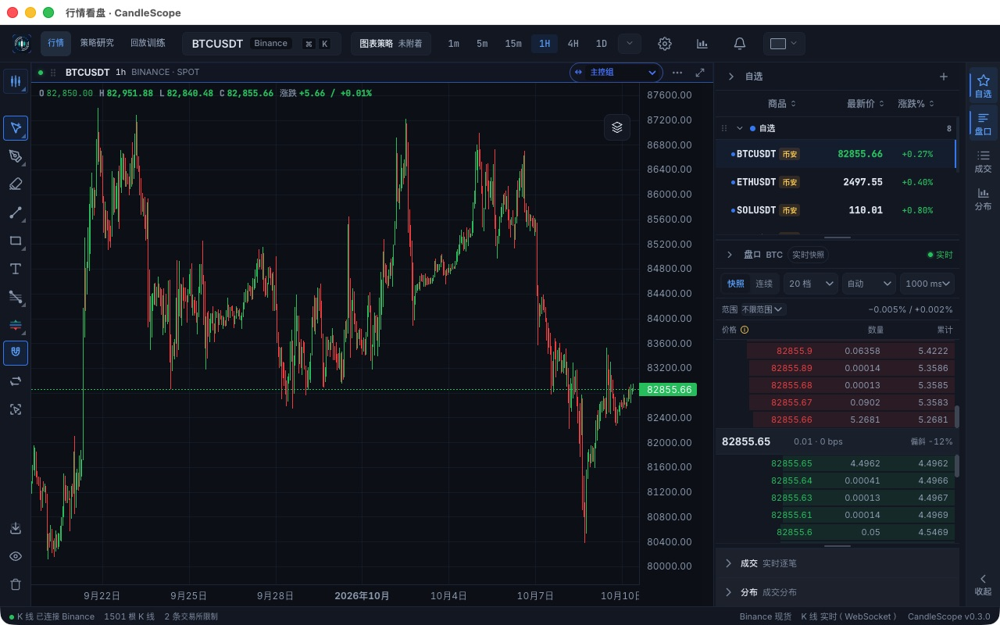

### 02. 双图布局 — 通过

左右分别显示 1h、15m，图表和盘口同屏可用。仅验证左右双图与恢复单图，未穷举其他布局。

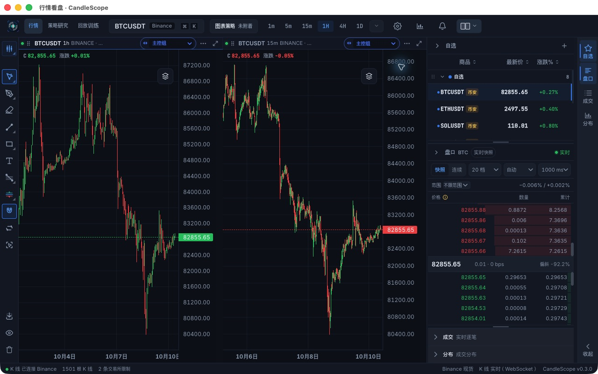

### 03. 矩形绘图 — 部分通过

矩形成功绘制，显式光标按钮可退出。Escape 后工具图标仍高亮，不能确认快捷键退出成功，列为待复核项。重启后图形保留。

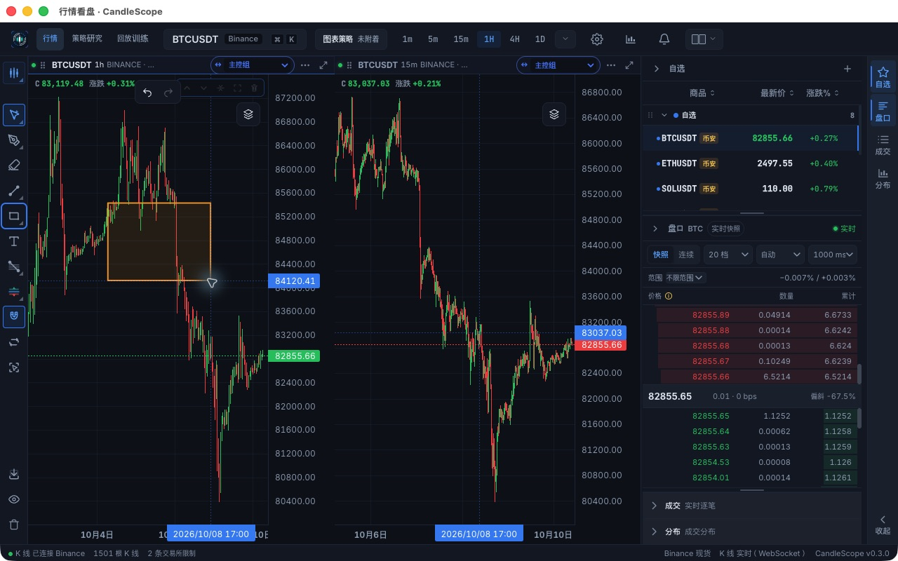

### 04. 主题与语言 — 有问题

亮色主题、德语懒加载和恢复深色中文成功。运行中切回中文后日期轴仍使用德语缩写，见第 6 步；重启恢复，见第 12 步。

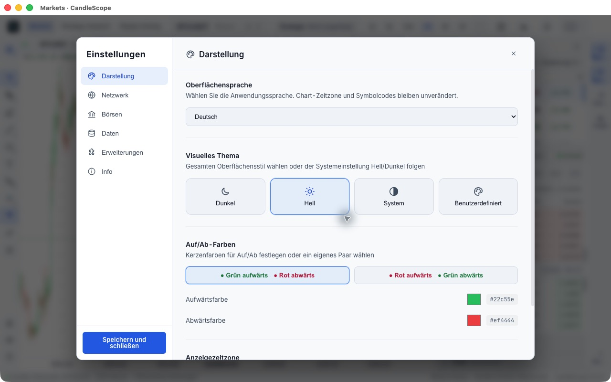

### 05. 插件中心与运行时 — 部分通过

本轮首次启动日志确认自动安装 Pine 0.3.2，卡片显示可用，后续实际计算成功。Pyne 在本机不可用；顶部文案错误地概括为全部运行时不可用。共享旧 Hello 插件处于信任绑定失效状态。

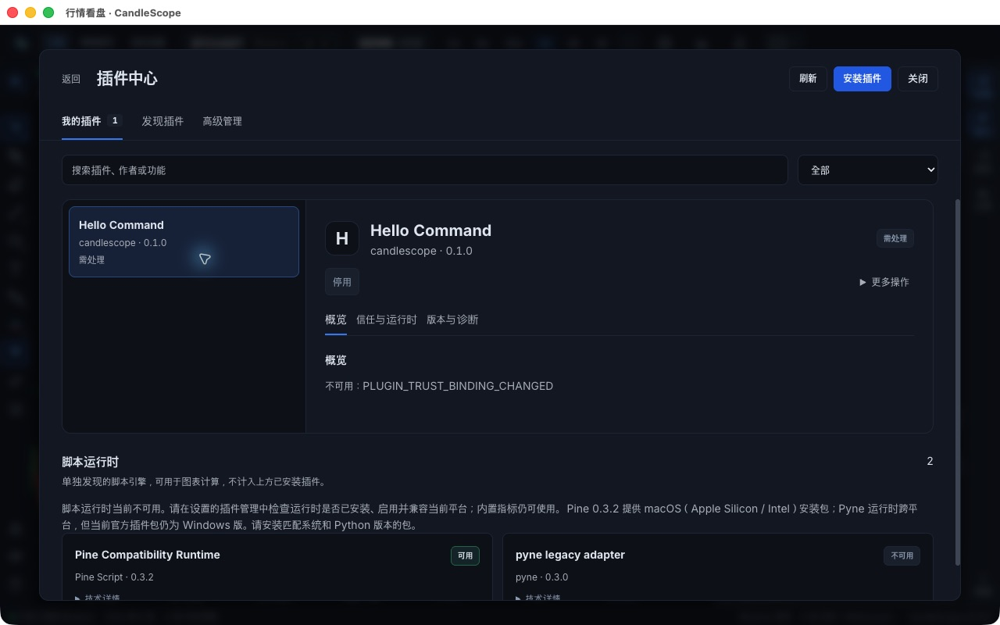

### 06. Pine 自定义指标 — 通过，附显示问题

新建 PR QA Pine SMA，执行 ta.sma(close,20) 成功，保存后正确标记主图。中文界面的日期轴仍出现 Sept./Okt.。

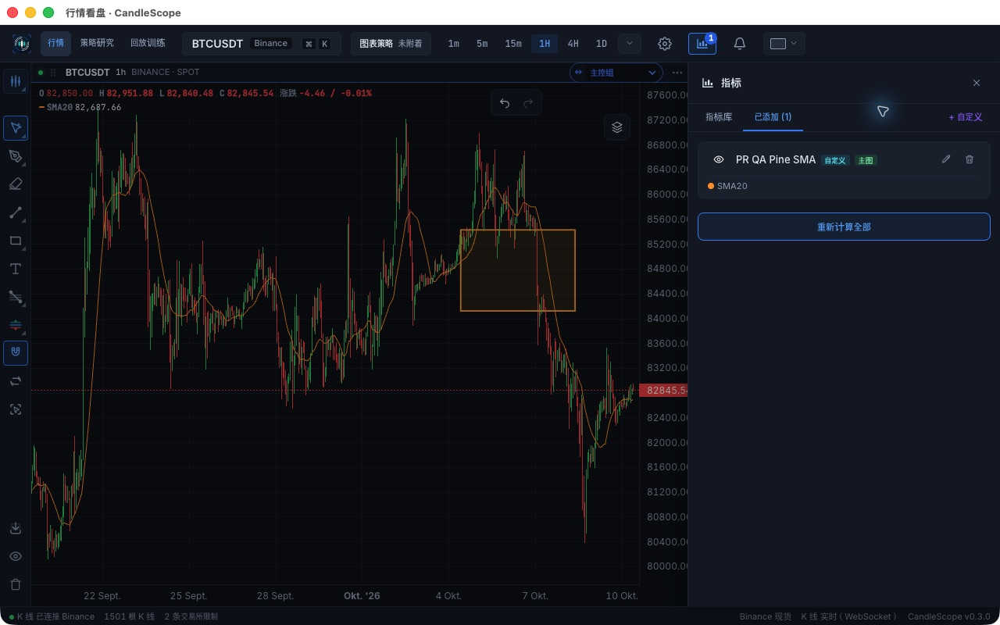

### 07. CSV 与原生策略 — 通过

通过界面导入 PR QA 600 / QA-TEST / 1m 的 600 根数据。参数 [] 被明确拒绝为非 JSON 对象；改为 {} 后 Native SMA 完成，权益变化 60.49、6 笔交易、12 个订单。

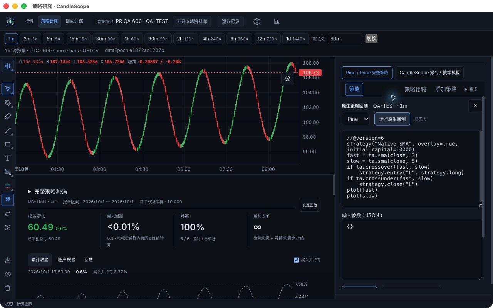

### 08. 原生交互回放 — 通过

创建回放、单步到 1/600、键盘输入跳至 600/600 COMPLETED、保存并恢复快照到 600/600 PAUSED 均成功，报告保留。

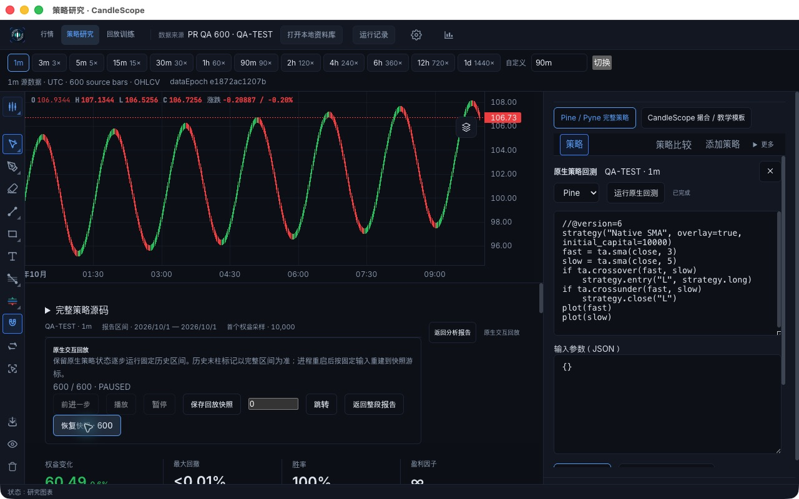

### 09. 教学模板与高级研究 — 有问题

SMA Cross 教学模板完成，600 根数据、6 笔交易和 Run 成功传入高级研究。JSON 导出后已在文件系统验证为有效 JSON（51342 字节，含 manifest/report/csv）。状态提示和布局存在问题，见下文。

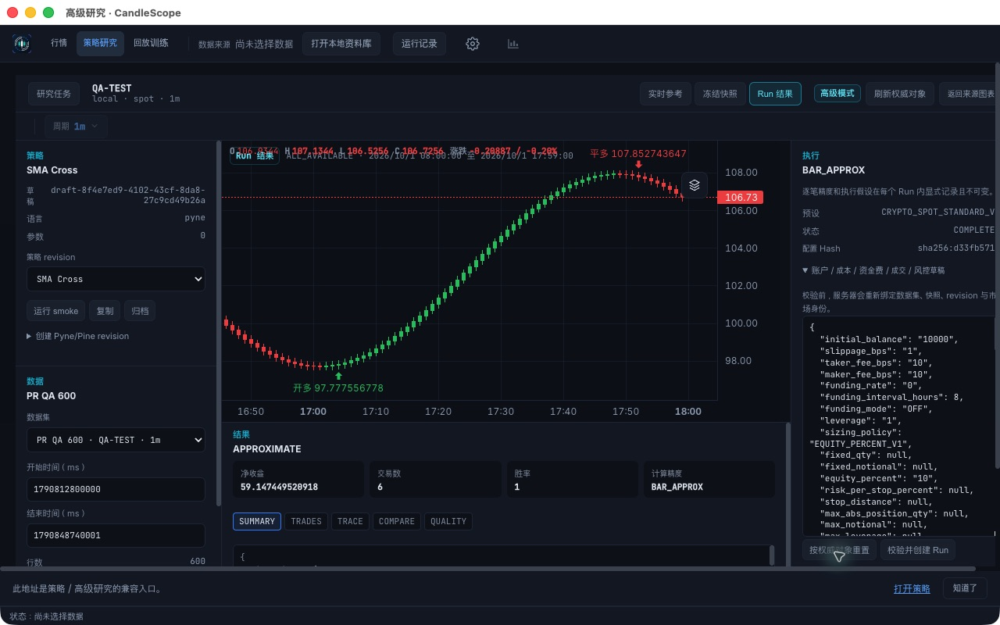

### 10. 独立练习与模拟下单 — 通过

练习预设自动准备 BTCUSDT 合约历史并进入训练；下一根从 200 推进至 201 根。0.001 BTC 模拟市价开多后持仓、成交与保证金更新。此为训练账户。

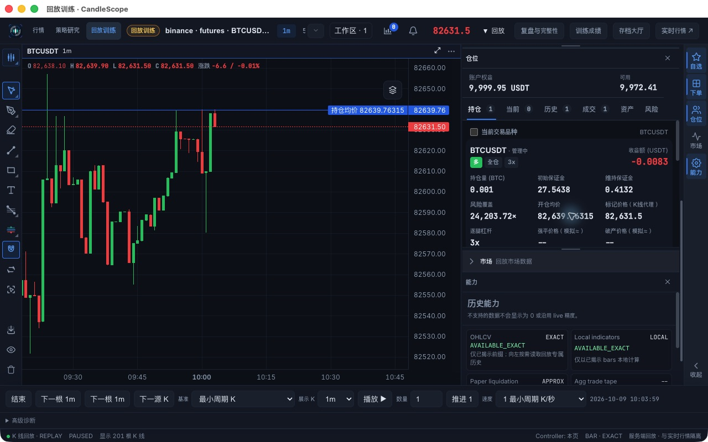

### 11. 模拟平仓与存档 — 通过

市价全平后持仓 0、成交 2；返回大厅显示 PR QA Practice 已暂停、权益 9999.90，可继续。

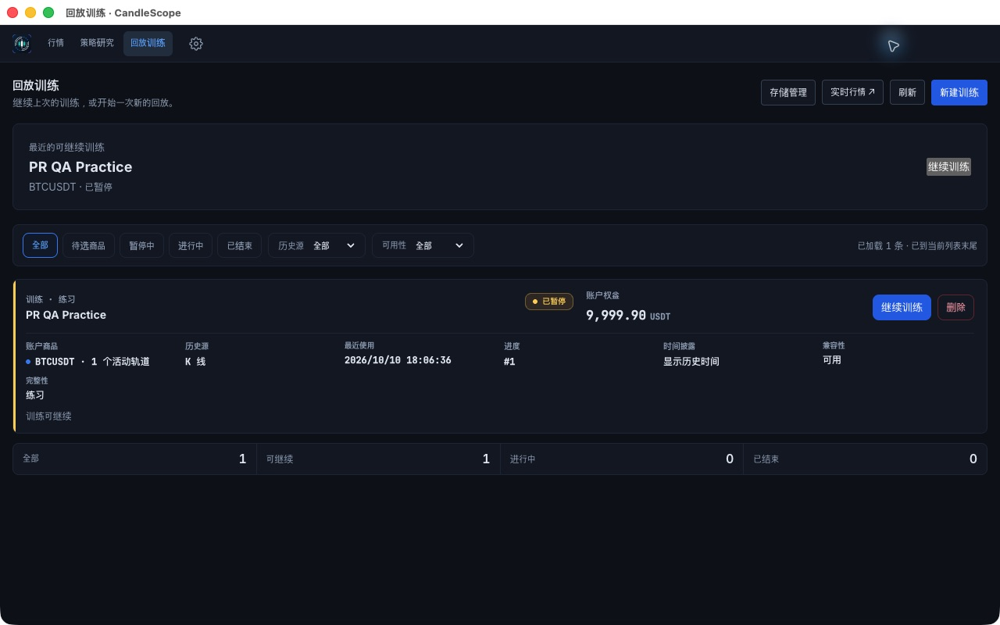

### 12. 重启行情工作区 — 通过

退出并重新启动生产包，仍使用端口 18079。Pine SMA20 继续计算，矩形保留，中文日期轴恢复。

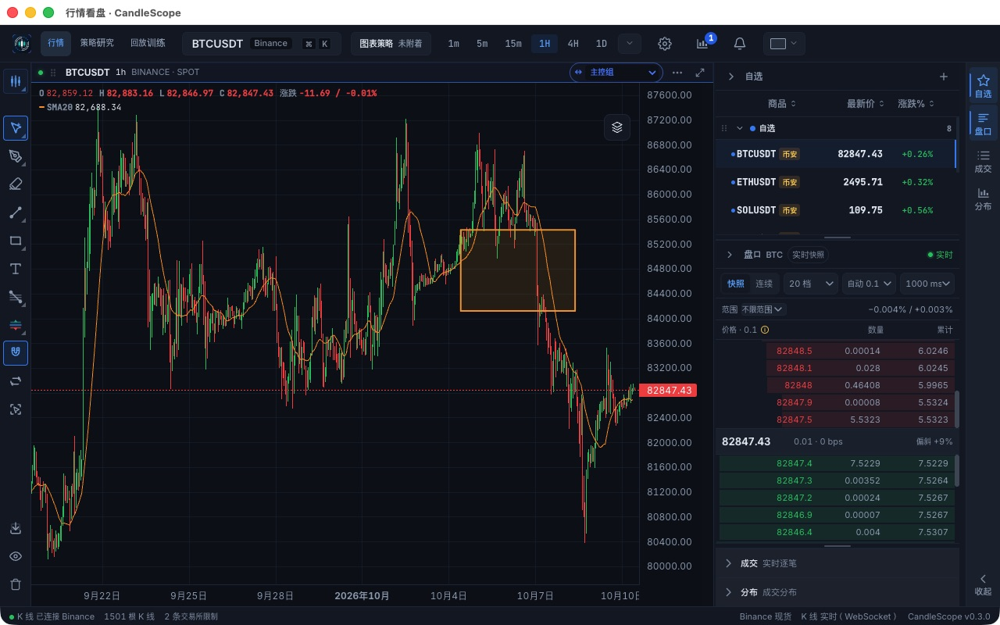

### 13. 重启恢复练习 — 通过

从行情页打开训练并继续同一 run，恢复至 10:03:59、201 根；账户权益 9999.9、持仓 0、成交 2 保留。截图显示工作区，账户数值另由同轮原生 AX 状态核对。

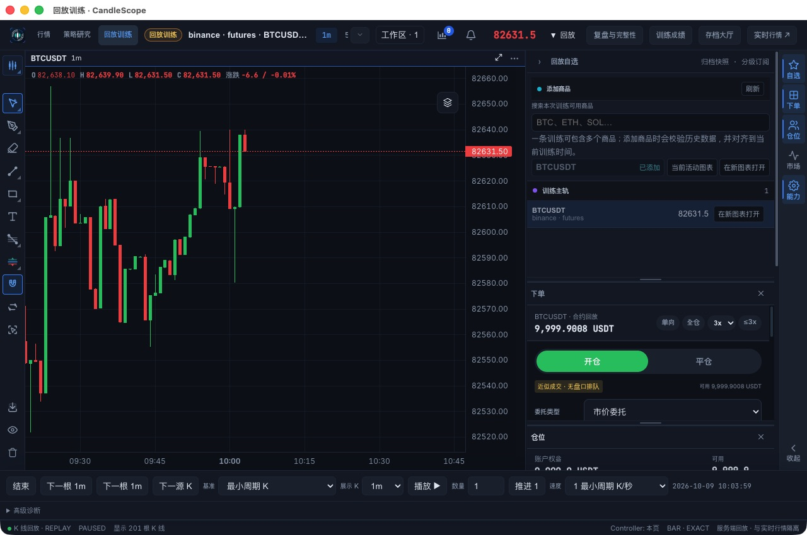

### 14. 重启恢复策略快照 — 通过

研究数据集、Native SMA 脚本和报告保留。点击继续历史回放，再恢复快照，回到 600/600 PAUSED；6 笔交易、12 个订单保留。

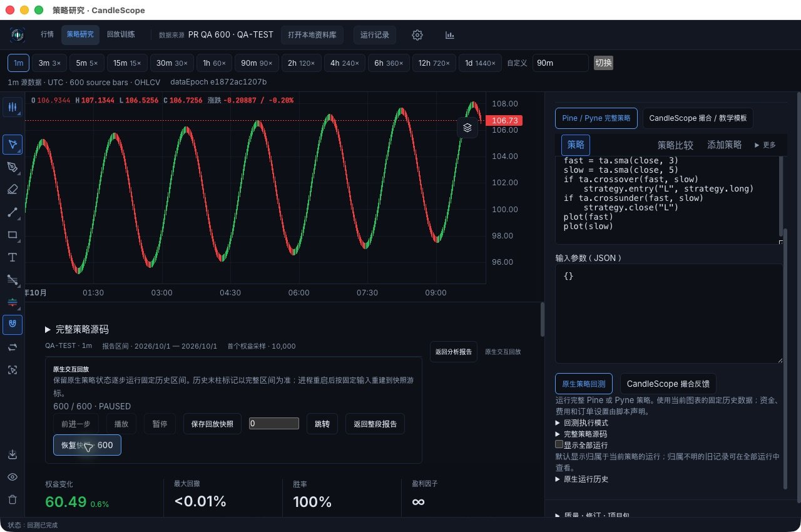

## 可访问性与设计范围

- 行情、练习和研究的主要控件有原生可访问性名称，测试可定位按钮、输入框和状态；JSON 错误有文字反馈。
- 第 9 步的重叠、裁切和技术字段堆叠增加低视力用户及新用户的阅读负担；第 4 步德语设置存在按钮换行，但本次没有遮挡操作。
- 第 10、13 步侧栏多个面板需要滚动才能看全账户操作；未据此判定功能不可用，建议后续检验键盘焦点能否可靠滚入可视区。
- 未运行屏幕阅读器全流程、对比度测量、键盘完整遍历或系统文字缩放测试，不能声称符合完整 WCAG 标准。

## 未覆盖与证据边界

- 多代理负载均衡、代理切换和断网恢复；当前 TUN 保持原样。
- Pyne 原生策略在本机不可用，未完成 macOS 安装验收；本轮没有重新查询上游发行列表。教学模板成功不等于原生 Pyne 运行时成功。
- 运行时手动归档安装、信任撤销/重授予和共享旧 Hello 的恢复没有本轮 UI 通过证据；自动安装 Pine 已由启动日志、可用卡片、真实指标与原生策略联合验证。
- 所有交易所、所有指标/绘图工具、全部布局、策略比较/批量研究、多商品训练、HEDGE/逐仓/保护单、训练成绩及完整性审计细分项未穷举。
- 警报创建和外部通知实际送达、存储删除、导出图片及跨机器分发未覆盖；没有操作真实资金。
- 未跑全量后端、所有 extended/gate 测试、长时间 soak、资源峰值及其他操作系统。
- 原生工具首次绑定超时以及 AX 对数字输入 setValue 未触发实际状态，均已改用正常交互后验证，不计为产品缺陷。

## 交付与复现

本机交付目录：`/Users/ryanliang/CandleScope/output/pr-user-qa-20261010/`。

- `启动PR验收版.command`：使用本轮 profile 启动 `CandleScope.app`，可继续查看数据集、Pine 指标、原生快照和模拟练习。
- `CandleScope-mac-arm64-PR-QA.zip`：仅应用包；`SHA256SUMS.txt` 提供校验。独立 profile 不在 ZIP 内。
- `PR-QA-backtest.json`：从本轮教学回测界面导出的有效 JSON。
- `test-logs/`：本轮自动检查、打包及启动日志；`验收笔记.md` 为包含更正记录的原始操作笔记。

本报告及 14 张证据图纳入 PR；运行 profile、日志和打包产物保留本机，不纳入 Git。
