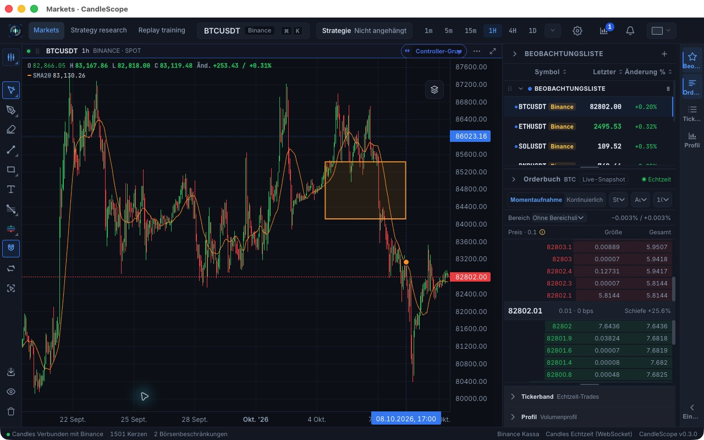
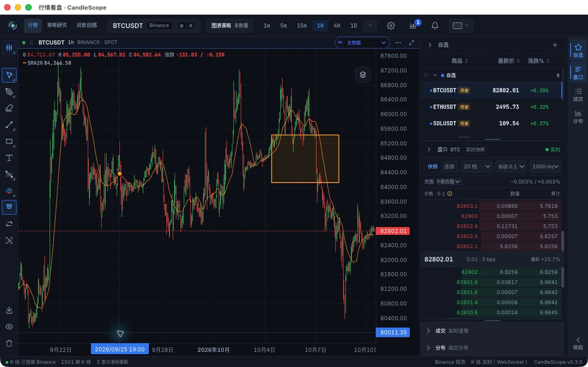
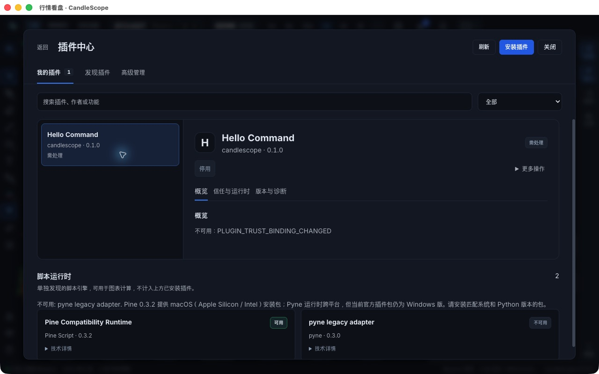
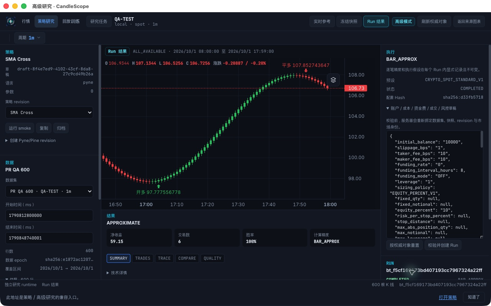
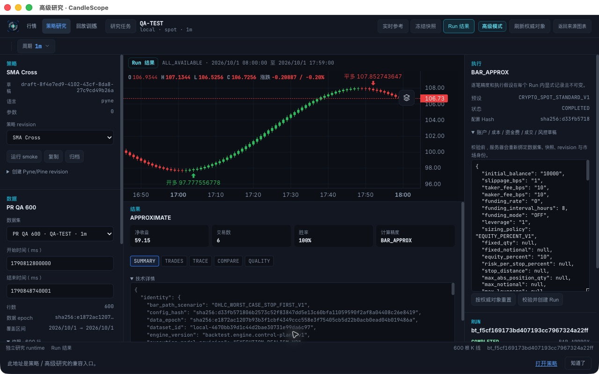
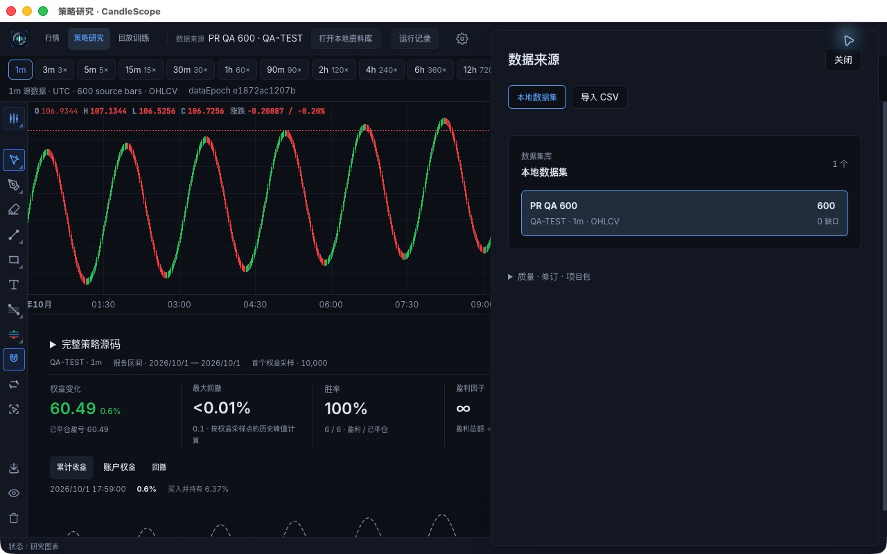

# PR #12 四项 UX 修复复测

日期：2026-10-10。结论：上一轮 UX-01～UX-04 已修复，并在新 macOS arm64 生产包通过针对性原生界面复测。

## 版本与变更

构建源码：`a4c50d4f`（包含 `4d9e14bb`）；分支 `codex/production-qa-pr`；[PR #12](https://github.com/helenananaa/CandleScope/pull/12)。后续报告提交只增加文档与证据。

| 问题 | 原因与修复 | 原生复测 |
| --- | --- | --- |
| UX-01 日期轴语言滞后 | SingleChartPanes 外观 effect 缺少 locale 依赖；语言切换现在重新应用图表外观与刻度格式化器 | 步骤1、2：不重启切换德语再切回中文，通过 |
| UX-02 运行时提示过度概括 | 之前任一引擎不可用就显示全部运行时不可用；现在提示中只列出不可用引擎名称 | 步骤3：Pine可用，只点名Pyne不可用，通过 |
| UX-03 高级研究空数据误报 | 高级研究被嵌套在普通研究框架内，外层读了独立的空状态；改由高级研究自己的框架和权威数据负责导航及状态 | 步骤4：Run结果/600根/真实run id，通过 |
| UX-04 高级研究布局与数值格式 | 移除重复全窗口布局；顶部可换行；Run信息占独立行；复用数值格式化，诊断JSON默认折叠 | 步骤4、5：1280×800下无旧裁切/重叠，59.15和100%正确，通过 |

旧入口的一次性迁移提示予以保留，容器采用剩余高度布局，避免提示将工作区挤出窗口。

## 自动检查

- `npm --prefix frontend run check` 最终完整通过：架构、插件边界、30语言 i18n、TypeScript、ESLint、3969项前端测试、86项桌面测试、Vite构建。
- 新增回归覆盖：Pine/Pyne混合可用状态、胜率比例与金额格式化、无交易/缺失胜率、诊断默认折叠；导航测试增加不得挂载普通研究空状态栏的断言。
- 导航及兼容入口定向测试12项通过。
- 中途检查曾发现旧入口迁移提示被移除，已恢复后重新完成全套检查；最终无失败。
- macOS arm64生产打包通过；交付app.asar与构建产物SHA256一致。ZIP完整性和SHA256校验文件随包提供。
- 本轮仅修改前端，未重新运行全量后端；上一轮后端176通过/4跳过不计为本轮新证据。
- 仍有Vite大chunk提示、未做Developer ID签名/公证；未增加性能量化结论。

## 本轮原生截图

### 1. 德语日期轴 — 通过

运行中由中文切换德语，日期轴立即显示 Sept./Okt.，行情、Pine SMA20 和矩形继续显示。

### 2. 中文日期轴 — 通过

同一进程内切回中文，无重启、无页面刷新，轴标签立即恢复 9月/10月；悬浮时间也恢复中文格式。

### 3. 运行时混合状态 — 通过

Pine 卡片仍为可用；提示明确为“不可用: pyne legacy adapter”，不再把可用的 Pine 概括为不可用。共享旧 Hello 的信任绑定状态未更改。

### 4. 高级研究状态与布局 — 通过

通过教学模板的高级研究按钮进入。只有一套导航和工作区，状态栏显示 Run 结果、600 根 K 线及真实 run id，不再显示尚未选择数据。1280×800 下右侧面板/按钮完整，无页面横向溢出；Run 信息位于独立行，与 OHLC 分开。净收益 59.15、胜率100%，诊断 JSON 默认收起。

### 5. 诊断与交易明细 — 通过

点击技术详情可以展开原始 JSON，未删减诊断内容；随后切换 TRADES，原生 AX 确認交易表列及 trade-1 等记录可访问。截图为展开详情状态。

### 6. 返回普通研究 — 通过

返回来源图表成功，PR QA 600 数据集与原生报告仍在；该返回链接按既有逻辑打开本地资料库，截图可见600根和原生权益变化60.49。

## 环境与限制

- 使用操控工具对实际Electron生产包交互，非浏览器开发服务；本机TUN不变。
- 最终使用上一轮原验收目录 `/Users/ryanliang/CandleScope/output/pr-user-qa-20261010/profile`，验证既有数据可以在新包中继续使用。
- 准备阶段尝试直接复制profile到新路径，触发 `CACHE_OWNER_MISMATCH`，后端拒绝启动；随后改回原目录成功启动。复制目录并非本轮通过的迁移方式，该路径/缓存归属限制未在本轮修复。新输出目录中的profile副本未继续使用，保留作诊断证据。
- 工具首次按路径绑定时另启动了一个实例，触发已占用端口提示；关闭重复实例后继续。没有把该工具启动冲突归为四项界面修复的失败。
- 本轮只对四项问题及相邻返回/详情路径做回归，不重复声称所有功能都已覆盖。原报告中Pyne、多代理、外部通知、其他OS、长时稳定性等未覆盖项继续有效；Escape绘图和旧Hello信任恢复仍为待复核项。

## 交付

本机目录：`/Users/ryanliang/CandleScope/output/pr-ux-fix-20261010/`。

- `启动修复验收版.command`：启动本轮新包并复用上一轮验收profile。
- `CandleScope-mac-arm64-UX-fixed.zip`、`SHA256SUMS.txt`：本轮生产应用及校验值，ZIP不包含profile。
- `test-logs/`：完整检查/构建/启动日志；`evidence/`：6张本轮截图。

旧报告作为修复前历史保留，当前四项结论以本报告为准。PR继续保持Draft，未合并main。
