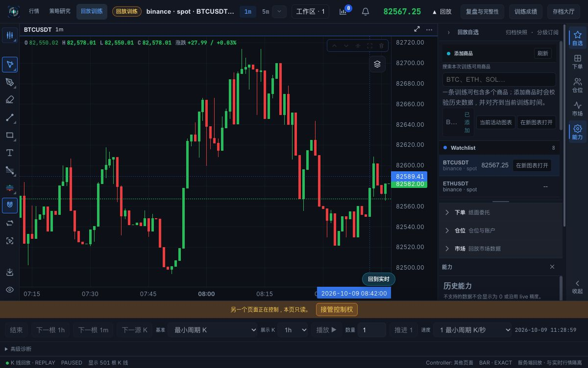
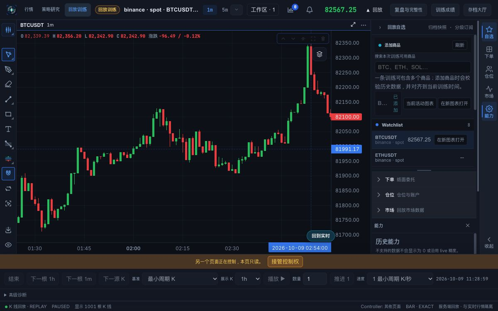
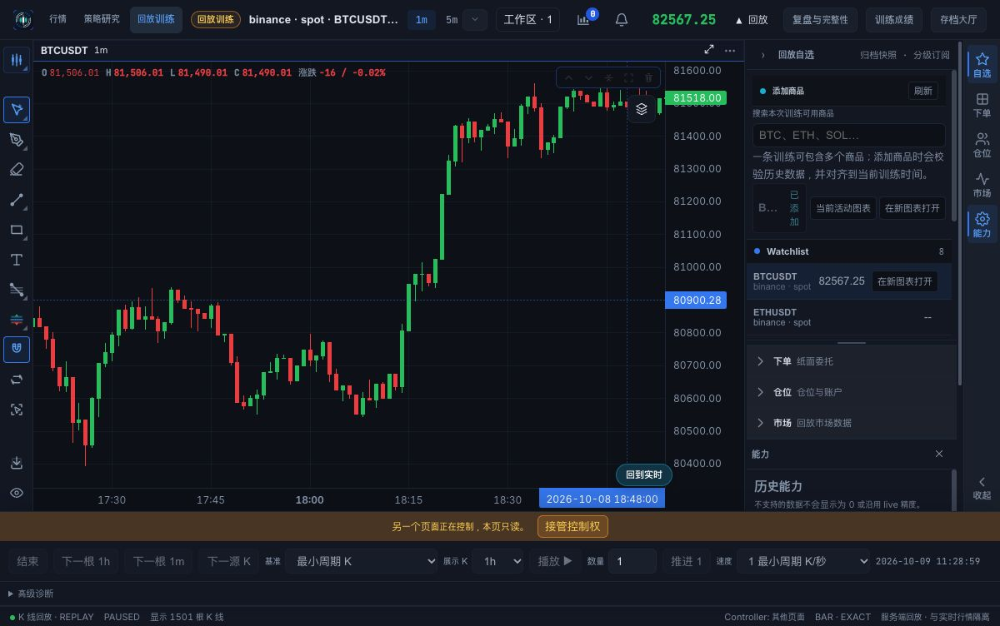
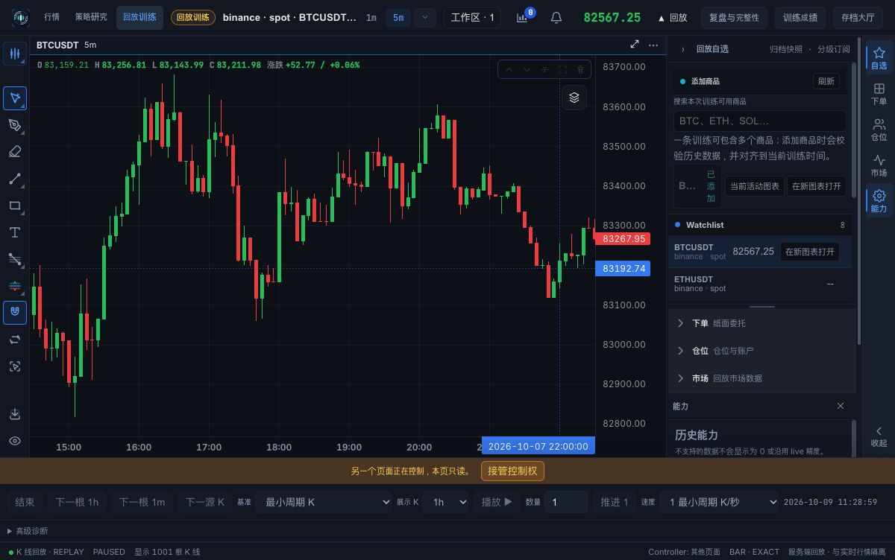

# 回放拖拽到左边界专项复测（2026-10-10）

源码 `f293d824`，文档基线 `65371f87`。测试使用上一轮 macOS 生产包正在服务的原始前端文件和原 backend / profile / 训练，未改动应用源码或重新打包。

## 方法与限制

原生 computer-use 的 drag 动作未产生可确认的图表移动，侧栏分隔线交叉测试也未移动。因此不能把它解释成图表缺陷，也不能声称 macOS 原生拖拽通过。

后续使用 Chrome 加载同一生产前端，通过仅监听 127.0.0.1 的临时 HTTP/WebSocket 转发连接原后端。通过 computer-use 支持的 CDP 鼠标按下、每 25 像素连续移动、松开事件执行真实图表拖拽。没有调用图表滚动 API、注入分页调用或使用滚轮替代。本次 Chrome 本地 UI 偏好独立，因此截图为深色；原生 profile 的浅色设置不变。浏览器作为只读观察页面，没有接管训练控制权。

## 实测结果

| 场景 | 结果 |
| --- | --- |
| 1m，初始 201 根，保持缩放，连续把图表向右拖以查看更早时间 | 越过原 08:08 边界后增至 501 根 |
| 继续拖至新的左边界 | 1001 根 |
| 再次连续拖到更早日期 | 1501 根，视口到 10 月 8 日 17:30–18:45 附近 |
| 切换 5m，初始历史准备完成 | 501 根 |
| 5m 连续拖过左边界 | 出现加载提示，完成后 1001 根，视口到 10 月 7 日 |
| 5m 加载期间与完成后对比 | 22:00 时间点保持在约 x=750；左侧空白补齐，价格轴随可见数据自动缩放，没有跳回训练当前时间 |
| 原存档状态 | PAUSED、source_sequence=1、equity=10000，未推进或下单 |

历史网络请求均获得 HTTP 200；1m before 游标连续向前分页，5m 左拖触发新的更早分页。网络证据保存在本地产物 `drag-evidence/history-network.json`。没有观察到无限加载、重复跳回最新视口或界面崩溃；本次未进行长时间性能测量。

结论：同一生产前端的鼠标拖拽历史分页通过，无新增应用修复。macOS 原生拖拽工具限制仍是验收缺口，不将 Chrome 结果冒充原生通过。测试临时浏览器页及转发服务在结束后关闭，原生应用保留。此前完整检查结果见 [历史加载修复报告](replay-history-fix-20261010.md)。
