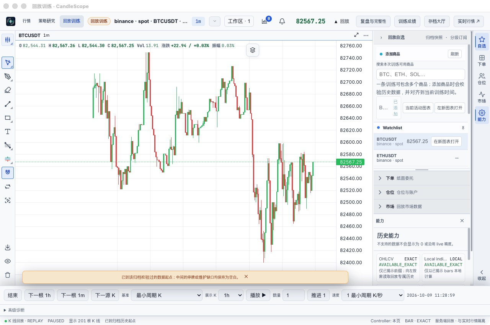
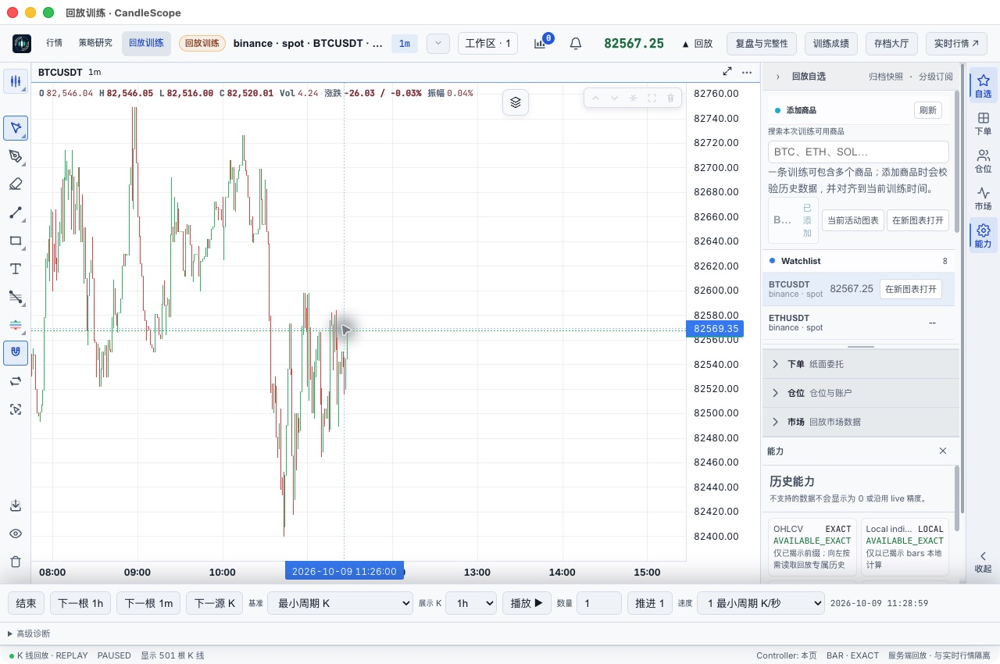
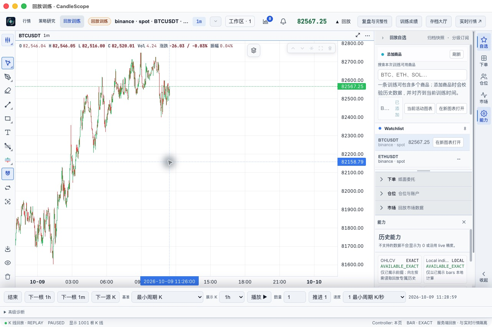
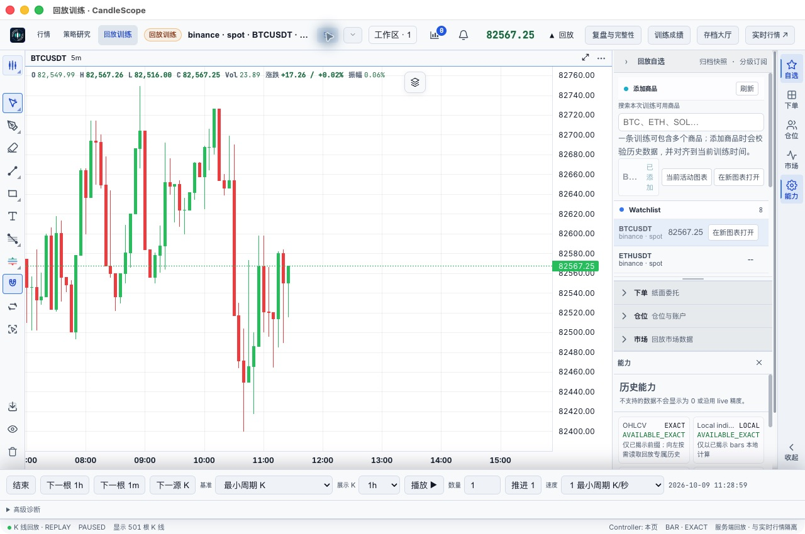
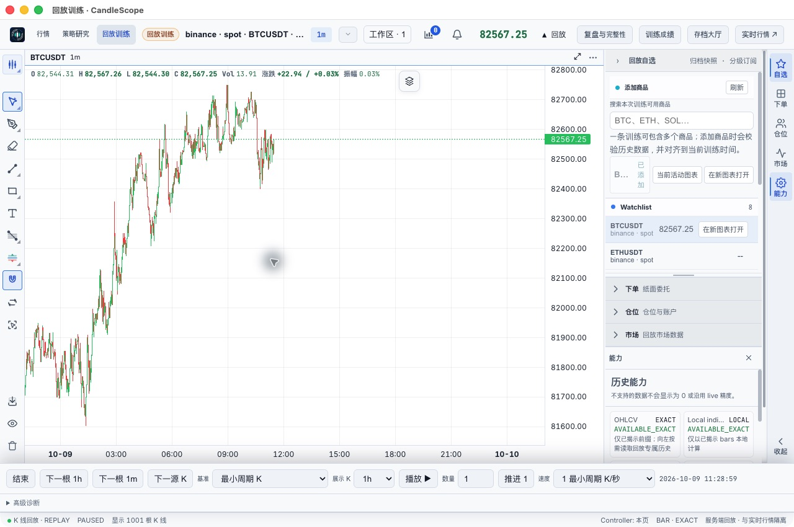

# 回放向左加载历史修复与复测（2026-10-10）

构建源码：`f293d824`，分支 `codex/production-qa-pr`，PR #12。macOS arm64 生产包，复用原验收 profile；本机 TUN 未调整。

## 原因和修复

自动准备的 ALL_AVAILABLE 训练实际上只固定了起点前的 200 根预热数据。回放查询把这段固定归档的起点当作全部历史的终点，所以向左到边界后显示 201 根，不再请求更早数据。

现在对自动准备的 1m BAR 训练，显示历史不足时通过既有 PreparationService 按页准备更早的已收盘数据，复用下载队列、连续性校验、缓存及存储预算。上下文历史只扩充图表，原执行数据版本、训练进度和账户不变；聚合周期跨固定归档边界时保留原归档数据。下载未完成或失败提供明确重试入口，不再误报已经到达历史起点。

## 生产版原生验证

原失败存档 `prepared-01b886e6e41541169a7a739e68f60d28`，BTCUSDT / Binance spot，保留原存档与原 profile。

| 操作 | 结果 |
| --- | --- |
| 打开原训练，缩小图表使视口触及左边界 | 201 → 501 根 |
| 再次触及左边界 | 501 → 1001 根，更早日期出现 |
| 切换 5m | 短暂加载提示后显示 501 根，正常绘制 |
| 切回 1m，回大厅，退出并重新启动 | 新后端端口 62517，新回放窗口正常打开 |
| 重启后再次触及左边界 | 501 → 1001 根，缓存历史可用 |
| 检查原存档 | 仍为 PAUSED、source_sequence=1、equity=10000 USDT |

原生操作使用 computer-use。历史分页通过鼠标滚轮缩小视口触及左侧触发；自动化拖拽未获得可靠位移，因此不单独宣称拖拽手势已经验收。没有推进原训练或下单。

前三次历史准备任务的创建到 READY 耗时分别为 1.212 秒、0.615 秒、2.319 秒（任务耗时，不是完整 UI 延迟测量）。切回周期时另有覆盖缓存的范围选择任务，20 毫秒 READY、reserved_bytes=0，复用原缓存对象；不把新任务记录误认为重复下载。重启后历史恢复有 UI 截图及请求证据。

## 自动化与打包

- `npm --prefix frontend run check`：架构/插件边界、30 语言 i18n、TypeScript、ESLint、3970 前端测试、87 desktop 测试及 Vite 构建通过。
- 后端五个测试文件合计 73 passed：prepared context、V2 history、progressive history、data preparation、progressive preparation。覆盖旧存档、普通/渐进式准备、隐藏时间、并发请求、缓存复用、5m 聚合、网络失败重试、下载等待、数据缺口和 epoch/未来边界拒绝。未运行全量后端测试。
- `npm --prefix frontend run desktop:package:dir -- --mac --arm64` 成功；包内关键后端文件与构建源码一致。保留 Vite 大 chunk 提示和既有 Starlette 弃用警告。
- ZIP 完整性检查和 SHA256 清单随本地产物保存。

## 验证边界

本次只处理回放更早历史的加载。未验收所有交易所、交易对上市起点、大周期/日历周期原生操作或长时间压力。源数据缺口或上市前空范围仍会返回可重试错误，不编造 K 线；更友好的真实最早历史终点识别尚未包含。本轮未声称全项目问题清零。

包未做 Developer ID 签名/公证。此前报告中的侧栏挤压、插件信任恢复、Pyne 可用性及其他未覆盖项目仍保留，见 [上一轮报告](replay-window-fix-20261010.md)。

## 本地产物

目录：`/Users/ryanliang/CandleScope/output/replay-history-fix-20261010/`

- `启动历史加载修复版.command`：使用原验收 profile 启动新包。
- `CandleScope.app`、`CandleScope-mac-arm64-history-fixed.zip`、`SHA256SUMS.txt`。
- `frontend-check.log`、`backend-tests.log`、`build.log`、`original-run-before.json`、`original-run-after.json`、历史任务 JSON 和 evidence 截图。

后续 [拖拽专项复测](replay-history-drag-20261010.md)：生产前端 Chrome 连续鼠标拖拽通过；原生拖拽工具限制单独保留。
