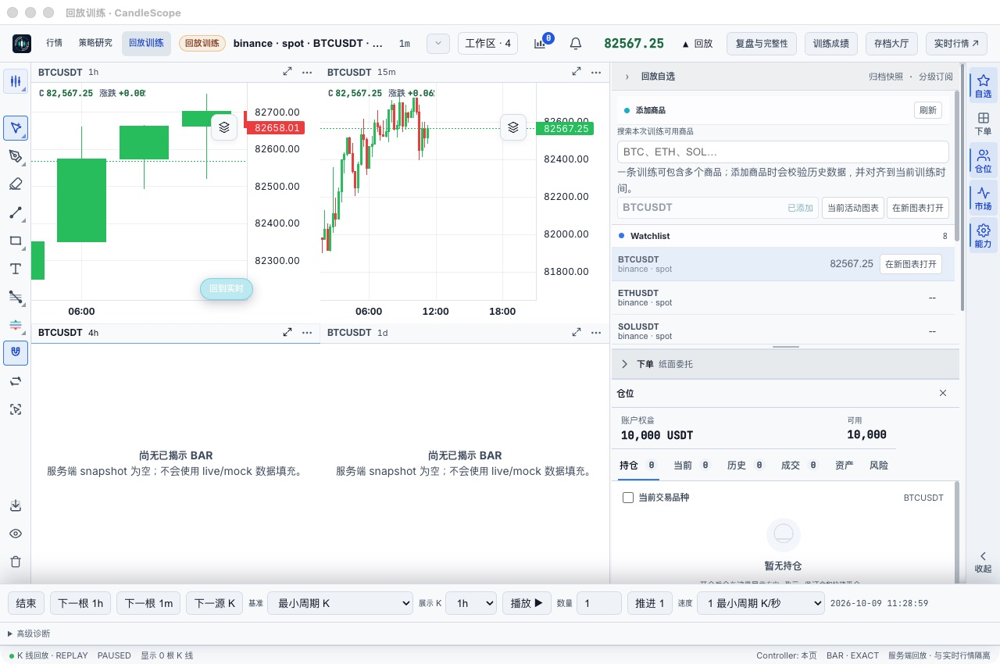
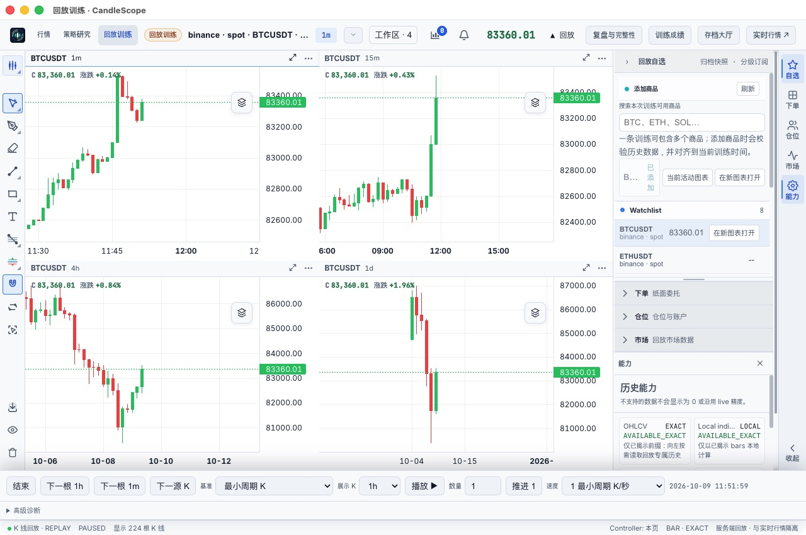
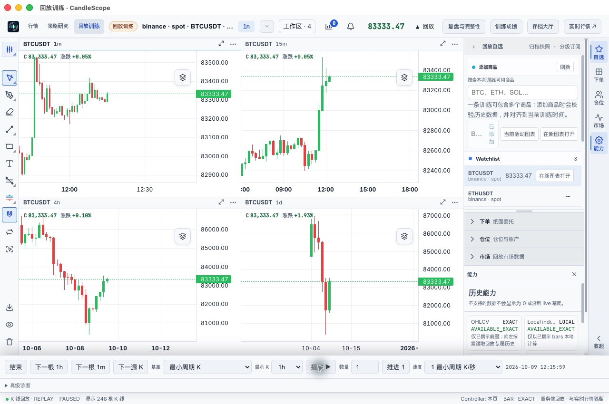
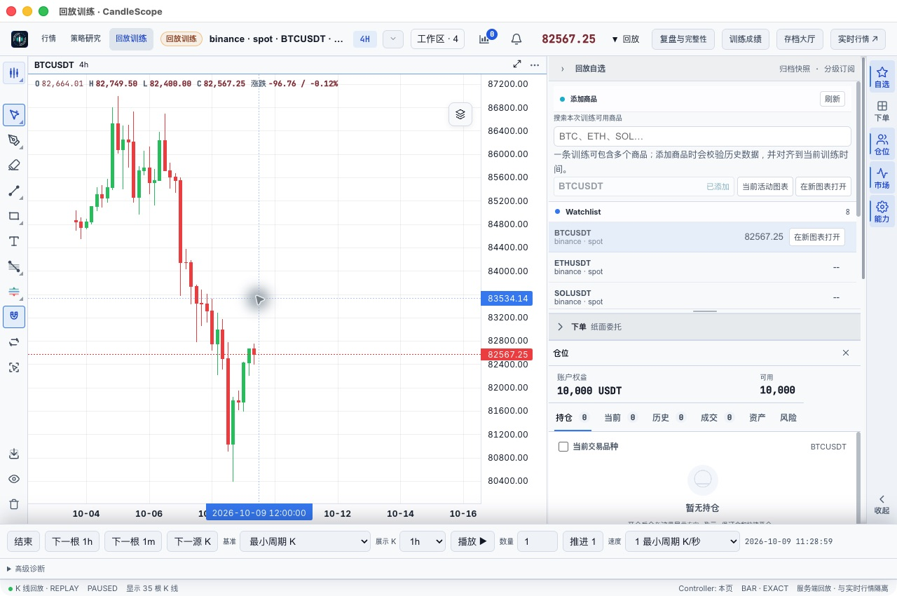
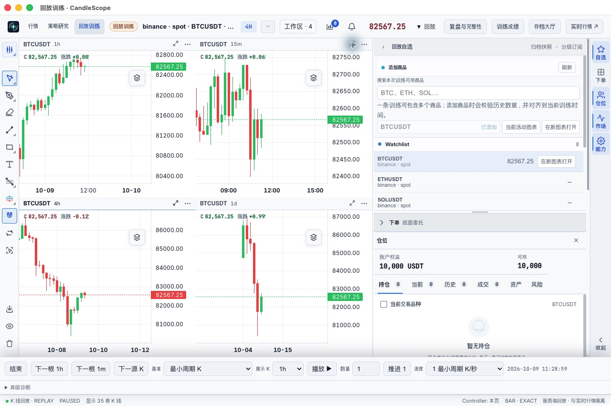
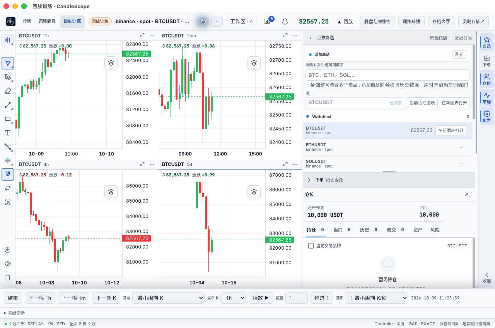

# 回放多图空白与大周期更新修复（2026-10-10）

最终生产构建源码：`0561bc48`（包括 `1a4cb83c`），macOS arm64。原生 computer-use 操作，使用原验收 profile。本轮未用浏览器替代原生多图验收。

## 漏测与现场

此前单图历史分页验收没有覆盖四图混合周期，结论不能外推到多图。用户报告“回放多图又崩了”后，现场看到应用仍运行、四图工作区的 1h/15m 有数据，而 4h/1d 长期显示空 snapshot，状态栏 0 根。本轮按功能不可用处理，没有把它当作正常空数据。

## 修复

1. **空图无法启动历史加载**：原前端要求权威投影已经有首根 K 线才允许分页；预热数据不足一个大周期时永远无法满足。后端投影新增可选 `history_before_ms`，为空投影提供公开且符合源周期网格的分页起点。每个图表独立接收该起点，身份变化时作废；已有非空图继续以实际首根为准。
2. **短预热被误判为坏策略**：源周期的首个完整桶在训练起点之后时，原历史接口返回 HISTORY_POLICY_INVALID。现在保留正确的公开边界，允许空前缀后续补历史，不伪造数据。
3. **大周期当前 K 线缺失**：第一版空图修复后，原生播放继续暴露出 4h/1d 只有旧收盘历史、当前价格不更新的问题。最终版通过既有准备队列补齐当前桶位于冻结预热前的缺失部分，并仅组合固定版本中已经揭示的数据。补齐历史属于显示上下文，不修改执行数据、账户或进度。
4. 每个空图区域独立显示加载状态和失败重试，不再只能通过共享状态栏判断。

## 最终包原生验收矩阵

| 操作链 | 实测结果 |
| --- | --- |
| 原存档恢复原四图（1h / 15m / 4h / 1d） | 四图均绘制；4h 35 根、1d 6 根；当前收盘价均为 82,567.25 |
| 4h → 15m → 4h | 当前图正常重新加载，其他图维持各自周期 |
| 最大化 4h → 还原四图 | 正常，当前价格与历史保留 |
| 四图关闭第四图 → 三图 → 第三图向右拆分 → 新第四图改为1d | 正常，日线重新显示6根，当前价82,567.25 |
| QA 存档创建四图、退出应用、最终包重新启动再进入 | 四图布局和周期恢复；QA进度24恢复 |
| QA 四图播放 11:51:59 → 12:15:59，再暂停 | 跨12:00的4h换柱及12:15的15m换柱，四图收盘价均更新到83,333.47；状态PAUSED，进度48 |
| 从QA大厅返回原存档 | 原四图恢复；原存档仍PAUSED、进度1、权益10000 USDT |

本轮没有推进原存档，没有在原存档下单。QA Replay Window Fix由进度10推进到48；其中第一版包播放/单步到24，最终包播放到48。第一版还验证了1d→5m→1d、最大化及关闭拆分，但第一版当前大周期尾柱未补齐，因此这些中间截图不作为最终价格正确的证据。

## 自动化和交付校验

- `npm --prefix frontend run check` 完成：架构/插件边界、30语言i18n、TypeScript、ESLint、3973前端测试、87桌面测试及Vite构建通过。后续尾柱修复只改后端，前端源码未再变化。
- 最终后端定向测试70 passed：prepared context、native seam、V2 history、progressive history、history archive。覆盖普通/渐进式存档、显示/隐藏日期、4h/1d空前缀与当前尾柱、分页衔接、时间边界、账户/数据版本不变。未运行全量后端测试。
- 新增前端测试覆盖空投影游标、未来游标拒绝、多图独立游标、epoch变化后失效。
- 最终重新执行macOS arm64生产打包；三份关键后端源码与交付包逐字节一致。
- ZIP完整性和SHA256已验证。仍无Developer ID签名/公证；Vite大chunk提示保留。

## 保留的验收缺口

本轮通过的是同一BTCUSDT训练的多周期四图。多商品同时训练与账户交易组合、跨原生窗口联动、所有指标/绘图组合、长时间压力和弱网恢复没有全部覆盖。原生drag工具限制仍保留，不把此前Chrome拖拽结果当作原生拖拽通过。本轮没有全项目无缺陷或长期不卡顿的结论。

## 本地产物

`/Users/ryanliang/CandleScope/output/replay-multichart-fix-20261010/`

- `启动多图修复版.command`、`CandleScope.app`、`CandleScope-mac-arm64-multichart-fixed.zip`
- `SHA256SUMS.txt`、`zip-check.log`、`frontend-check.log`、`backend-tests.log`、`build.log`
- `run-before.json`、`run-after.json`、`qa-run-after.json`、`evidence/`

新包使用原profile；最终停留在原训练四图页面，供继续使用。PR保持Draft，未合并main。
