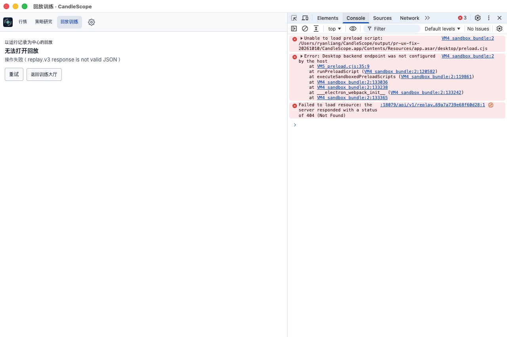
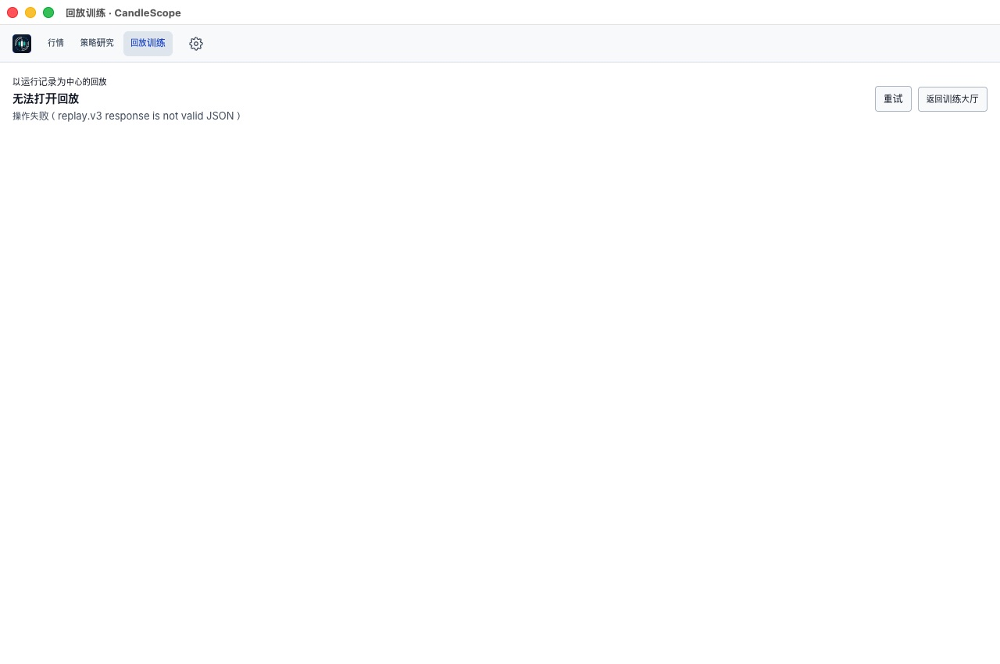
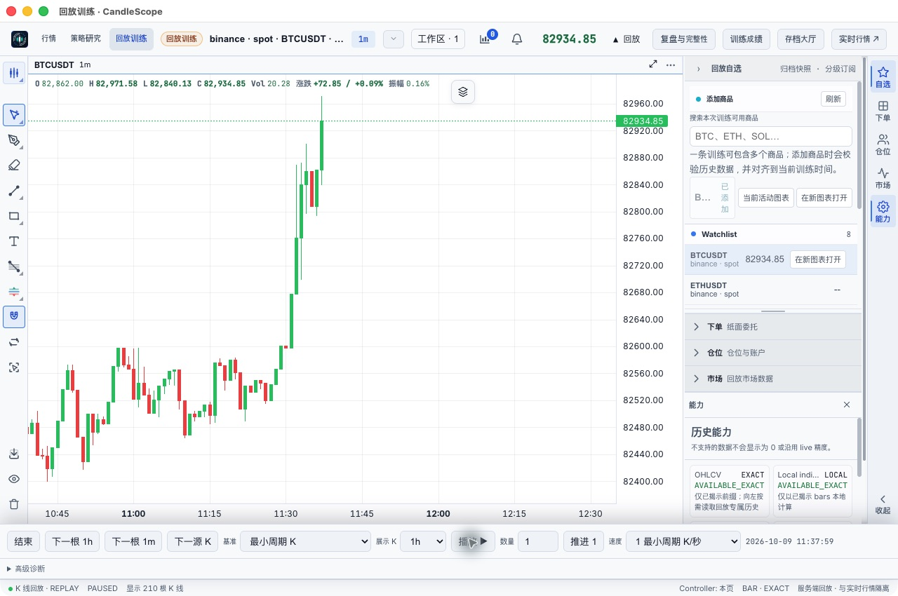
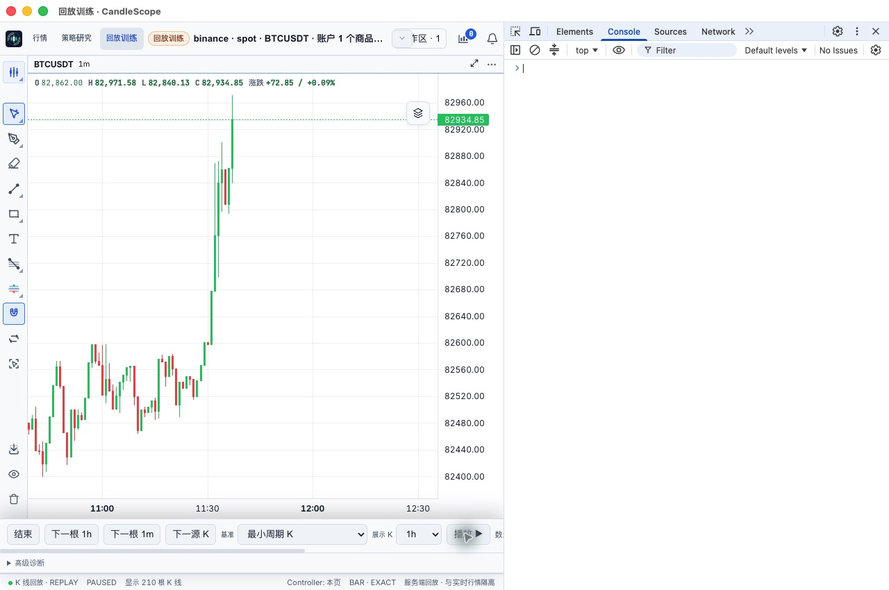
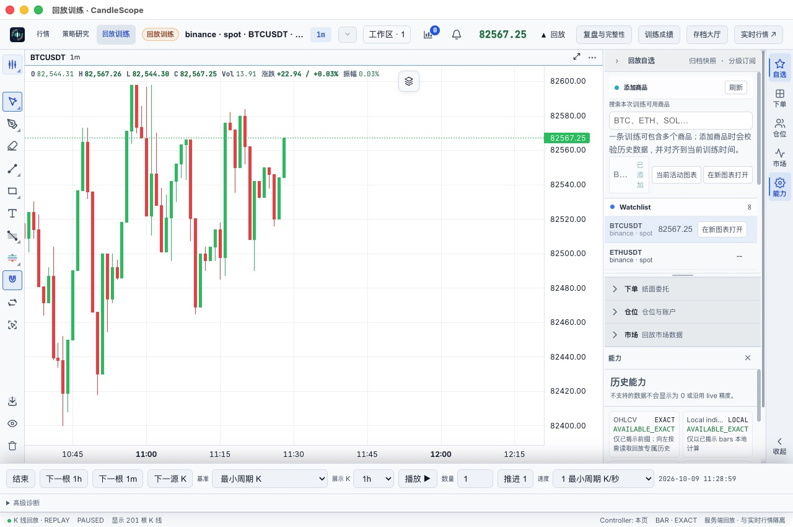

# 回放新窗口启动失败修复复测

日期：2026-10-10；源码：`87592fd9`；分支：`codex/production-qa-pr`；PR #12。

## 用户报告与原因

用户在此前四项 UX 修复包中创建训练后，新窗口显示“无法打开回放 / replay.v3 response is not valid JSON”。现场确认这是实际可复现的产品缺陷；此前四项 UX 定向复测没有覆盖这次失败路径。

- 失败训练：`prepared-01b886e6e41541169a7a739e68f60d28`。
- 新窗口控制台：preload 抛出 `Desktop backend endpoint was not configured by the host`。
- preload 依赖 renderer argv 获取后端端口；现场没有获得合法端口，桌面 bridge 没有暴露。前端因此退回相对 API 路径，向 UI 静态服务器 `18079` 请求训练，得到 404，再报 JSON 解析错误。
- 同时直接读取后端 `18080` 的相同训练接口得到 200 application/json、PAUSED、READY，说明原训练数据存在。没有清理或重建用户的训练来绕过问题。
- 已确认的是上述启动链路失效；没有进一步断言 Electron 内部为何未传入有效 argv。

## 修复

每次 preload 初始化通过同步 IPC 向主进程获取实际后端端口，不再依赖 renderer argv。主进程在加载窗口前注册处理器，并使用已有的受管理窗口、主 frame、本地应用 origin 校验。端口缺失、被拒绝、非法类型或越界时仍明确失败，不回退到猜测的端口。

## 验证结果

| 验证 | 结果 |
| --- | --- |
| 原失败训练从行情大厅继续 | 新原生 app-window-1 成功打开，200 根 K 线 |
| 原训练单步推进 | 200 → 201 根，价格随之更新 |
| 返回大厅并再次继续 | checkpoint 保存成功，进度 #1，恢复201根 |
| 关闭子窗口，从主窗口重新继续 | app-window-2 成功打开同一训练，保留201根 |
| 行情页新建训练 | 沿用用户原表单参数，命名 QA Replay Window Fix；app-window-3 自动打开 |
| 新训练播放和暂停 | 200 → 210 根，暂停成功，无 JSON 错误 |
| 新窗口控制台 | 未出现原来的 preload/404 错误；未手动清空控制台 |
| 退出并重新启动生产包 | 大厅保留原训练 #1 和新测试训练 #10 |
| 动态端口恢复 | 重启后实际后端监听55100，主界面和新回放窗口仍正常；原训练恢复201根 |

生产应用复用原验收 profile，保留用户浅色主题与数据。最后停留在原失败训练的已暂停页面。测试只推进了原训练一根 K 线，未在其中下单；新增测试训练保留在大厅供复查。

自动验证：87项桌面测试通过；ESLint通过；git diff --check通过；macOS arm64生产构建通过。回归测试覆盖无 argv、过期 argv 与环境端口、非法/拒绝的主进程响应，以及新回放窗口的可信主 frame和子 frame拒绝。交付包内 main/preload/IPC contract 与当前源码逐字节一致。

本轮只修改桌面启动链路，未重新宣称全量前后端测试通过。上一轮3969项前端测试属于上一轮证据。仍有未签名/未公证和Vite大chunk提示。

## 现场与修复截图

## 范围与交付

本轮验证的是回放窗口启动、恢复、推进、保存和重启链路，没有替代完整功能验收。本机TUN未调整，多代理未测。目视发现回放侧栏较窄时“已添加”商品行仍有挤压换行，属于另一个布局问题，本次未修改；其他既有验证边界继续见此前报告。

本机交付目录：`/Users/ryanliang/CandleScope/output/replay-window-fix-20261010/`。包含应用、`启动回放修复版.command`、ZIP、SHA256、构建/测试日志和截图。启动脚本继续使用原profile，ZIP不含用户profile。
